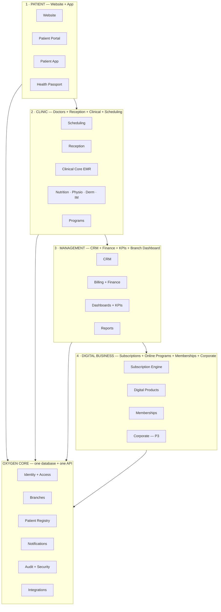
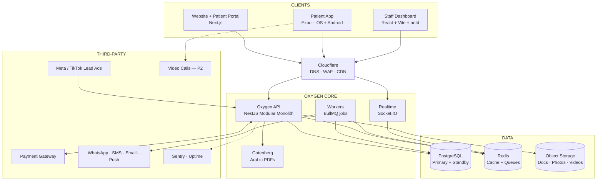
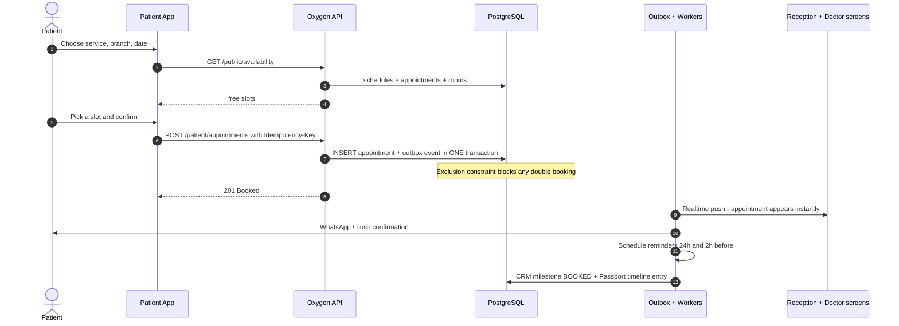

# 02 — System Architecture

> بيرد على: **DEL-01 Proposed System Architecture** + §27 (قابلية التوسع) + §28 (الشكل النهائي).

---

## 1. الصورة الكبيرة: الـ4 مستويات اللي في البريف

البريف (§28) رسم 4 مستويات كلهم مربوطين بـ**OXYGEN CORE**. ده نفس الرسم لكن متقسم لـModules حقيقية:



**الفكرة:** المستويات الأربعة مش 4 أنظمة منفصلة. هي 4 "واجهات" لنفس النظام ونفس الداتابيز.
المريض اللي حجز من التطبيق هو نفسه اللي ظاهر في الـCRM وفي الـDashboard وفي تقارير الفرع، من غير أي ربط أو نقل بيانات.

---

## 2. الـArchitecture التقني



| المكون | التكنولوجيا | دوره |
|---|---|---|
| Website + Portal | Next.js | الويبسايت التسويقي، الحجز والدفع، وبوابة المريض |
| Patient App | Expo | تطبيق المريض الواحد لكل التخصصات — بييجي بعد الويب |
| Staff Dashboard | React + Vite + antd | كل الشاشات الداخلية: ريسبشن، أطباء، CRM، إدارة، CEO |
| Cloudflare | — | DNS، حماية من الهجمات (WAF)، CDN للصور والفيديو |
| Oxygen API | NestJS | كل الـBusiness logic، والمكان الوحيد اللي بيلمس الداتابيز |
| Realtime | Socket.IO | تحديث لحظي للكالندر والـCheck-in |
| Workers | BullMQ | التذكيرات، الإشعارات، التجديدات، حساب الـKPIs |
| Gotenberg | Chromium | فواتير وتقارير PDF بالعربي |
| PostgreSQL | Managed | الداتا كلها، مع نسخة احتياطية جاهزة (Standby) |
| Redis | Managed | Cache + Queues + Rate limiting |
| Object Storage | S3-compatible | الملفات الطبية (Private) + الفيديوهات (عن طريق CDN) |

---

## 3. مبادئ المعمار

1. **مصدر واحد للحقيقة:** داتابيز واحدة، وكل الواجهات بتكلم نفس الـAPI.
2. **Modular Monolith:** Backend واحد متقسم Modules بحدود واضحة. أسهل في التشغيل وأرخص، وأي Module ممكن يتفصل لـService لوحده بعدين.
3. **API-First:** كل حاجة متاحة عن طريق REST API موثّق (OpenAPI)، ونفس الـAPI ده هو اللي أي Developer أو شريك هيستخدمه بعدين.
4. **Event-driven من جوه:** أي حدث مهم (حجز، دفع، تقييم…) بيطلّع Event، وباقي الموديولز بتسمعه: الـCRM يحدّث المرحلة، الإشعار يتبعت، الداشبورد يتحدث، والـPassport يضيف سطر. **ده اللي بيخلي النظام "Smart"** من غير ما الموظف يدخل نفس الداتا مرتين.
5. **Multi-branch من أول يوم، وجاهز لـSaaS:** كل جدول فيه `organization_id`، واللي يخص فرع فيه `branch_id`.
6. **Configuration over Code:** البرامج، والفورمز الطبية، والمنتجات والباقات، وقوالب الإشعارات، وأوقات العمل — كلها بتتعمل من الشاشات مش بالكود.
7. **Security by Design:** الصلاحيات بتتفحص في الـBackend (مش مجرد إخفاء زراير)، وكل فتح لملف طبي بيتسجل.
8. **فصل اللي المريض يشوفه عن الداخلي:** كل عنصر طبي عليه `patient_visible`.
9. **Everything as Code:** الـInfrastructure (Terraform)، والداتابيز (Migrations)، والـCI/CD. أي Developer جديد يقدر يقوّم البيئة كاملة لوحده.
10. **Observability:** Logs + Errors + Metrics + Alerts من أول يوم.

---

## 4. جوه الـBackend

كل Module ليه نفس الشكل:

```text
src/modules/scheduling/            (في Repo الباك)
├── scheduling.module.ts
├── api/            Controllers + DTOs (Zod)
├── application/    Use-cases (BookAppointment, Reschedule, CheckIn …)
├── domain/         Business rules (Availability engine, Status machine)
├── infra/          Prisma repositories + External adapters
└── events/         Events بيطلّعها + Handlers بيسمع بيها
```

**قاعدة ذهبية:** أي Module بيكلم Module تاني من خلال الـService العامة بتاعته أو من خلال Events بس.
ممنوع Query مباشر على جداول Module تاني، والـCI بيرفض أي كود يكسر القاعدة دي (`dependency-cruiser`).

---

## 5. الـEngines: قلب الـSmart Clinic OS

| Engine | بيعمل إيه | بيخدم |
|---|---|---|
| **Availability Engine** | المواعيد الفاضية = جدول الطبيب في الفرع ∩ غرفة مناسبة فاضية − الحجوزات − الإجازات، مع مراعاة مدة الخدمة والـBuffer | §6 |
| **Form Engine** | الفورمز الطبية بتتعمل كـTemplates (JSON) ولها Versions، فأي تخصص جديد = Templates جديدة | §8 |
| **Program Engine** | برامج بمراحل (زي Secret Seven)، بيعرف المريض واقف فين، وبيشغّل Actions مع كل مرحلة | §9 |
| **Catalog & Entitlement Engine** | أي منتج (جلسة / باقة / اشتراك / عضوية / برنامج) = سعر + "حقوق" (Entitlements) المريض بيستهلكها | §10، §11 |
| **Subscription Engine** | دورات الفوترة، التجديد، الـGrace، والـUpgrade/Downgrade | §13 |
| **Journey Engine** | بيحوّل الأحداث لـMilestones لكل مريض (حجز / حضر / دفع / جدد …) | §7، §16 |
| **Notification Rules Engine** | الحدث + القالب + تفضيلات المريض + أوقات الهدوء → القناة المناسبة | §14 |
| **Permission Engine** | Role + Branch scope + Care-team scope + `patient_visible` | §4، §18، §25 |

---

## 6. الأحداث (Domain Events): مين بيطلّعها ومين بيسمعها

| Event | بيطلع من | بيسمعه |
|---|---|---|
| `LeadCreated` | CRM | Notifications (تنبيه للـAgent)، Analytics |
| `AppointmentBooked` | Scheduling | CRM (Booked)، Notifications (تأكيد + جدولة التذكيرات)، Realtime، Passport، Analytics |
| `AppointmentCheckedIn` | Front Desk | CRM (Visited)، Realtime، Analytics |
| `AppointmentCompleted` | Clinical | Billing (خصم جلسة من الباقة)، CRM، Reviews (P2)، Analytics |
| `AppointmentNoShow` | Scheduling | Notifications (رسالة إعادة حجز)، CRM، Analytics |
| `AppointmentCancelled` / `Rescheduled` | Scheduling | Notifications، Waiting list (P2)، Analytics |
| `EncounterSigned` | Clinical | CRM (Assessment)، Passport، Programs |
| `PlanPublished` | Clinical | Notifications (New plan)، Passport |
| `ProgramEnrolled` / `ProgramStageChanged` | Programs | CRM (Program)، Notifications، Content (P2) |
| `PaymentSucceeded` | Billing | Catalog (إنشاء الـEntitlements)، CRM (Paid)، Notifications (إيصال)، Passport، Analytics |
| `PaymentFailed` | Billing | Subscriptions (إعادة المحاولة)، Notifications |
| `EntitlementExpiringSoon` / `Exhausted` | Catalog | Notifications (Package ending)، CRM (فرصة تجديد) |
| `SubscriptionRenewed` / `PastDue` / `Cancelled` / `Expired` | Subscriptions (P2) | Notifications، Analytics (MRR / Churn)، CRM (Renewal) |
| `ReferralConverted` | Referrals (P2) | Rewards، CRM (Referral) |
| `ReviewSubmitted` | Reviews (P2) | Analytics، وتنبيه للمدير لو التقييم ضعيف |

**التنفيذ — Transactional Outbox:** الحدث بيتكتب في جدول `outbox_events` **في نفس الـTransaction** بتاعة العملية نفسها، وبعدين Worker بيوزّعه.
النتيجة: مستحيل يحصل دفع من غير ما الإيصال يتبعت والـCRM يتحدث، حتى لو السيرفر وقع في النص.

---

## 7. مثال: حجز من التطبيق خطوة بخطوة



---

## 8. Multi-Branch وتجهيز الـSaaS

- `organization_id` على كل الجداول (النهارده فيه Organization واحدة: Oxygen).
- `branch_id` على الجداول اللي تخص فرع: المواعيد، الغرف، الفواتير، الجداول، المصروفات…
- **المريض والموظف على مستوى الـOrganization**، مش الفرع. الموظف ممكن يشتغل في أكتر من فرع وبصلاحيات مختلفة في كل فرع.
- الأسعار والمدد ممكن تختلف من فرع لفرع (`branch_services`).
- الـCEO Dashboard فيه: فرع واحد / كل الفروع / مقارنة بين الفروع.
- **لما ييجي وقت الـSaaS:** نفس الكود، وكل مركز يبقى Organization. نفعّل PostgreSQL Row-Level Security كطبقة حماية إضافية، أو نعمل داتابيز منفصلة لكل عميل لو العقد يطلب كده.

---

## 9. تصميم الـAPI

- REST + JSON على `/api/v1/...` وموثّق بـOpenAPI 3.
- **3 مجموعات:**
  - `/public/*` — الويبسايت من غير Login (الخدمات، الأطباء، المواعيد المتاحة).
  - `/patient/*` — المريض، وبيشوف بياناته هو بس.
  - `/staff/*` — الموظفين، حسب الصلاحيات.
- **Auth:** الويب (Portal + Dashboard) بـhttpOnly Secure Cookies، والموبايل بـBearer tokens محفوظة في SecureStore.
- **Idempotency-Key** على الدفع والحجز: لو المريض داس مرتين ميتعملش حجزين أو دفعتين.
- **Pagination** بالـCursor، والفلاتر موحّدة في كل الـEndpoints.
- **Errors** بصيغة موحّدة (RFC 9457 Problem Details).
- **Webhooks داخلة:** `/webhooks/payments/:provider` · `/webhooks/meta` · `/webhooks/whatsapp` · `/webhooks/tiktok`، كلها بتتحقق من التوقيع وبتتسجل في جدول Inbox عشان نمنع التكرار.

---

## 10. Real-time

- Socket.IO بـRooms: `branch:{id}` و `practitioner:{id}`.
- Events زي: `appointment.created` · `appointment.updated` · `patient.checked_in`.
- الداشبورد بيحدّث البيانات لوحده، فالحجز اللي اتعمل من التطبيق بيظهر عند الريسبشن والطبيب فورًا (APT-06).

---

## 11. مسار التوسع (Scalability Path)

| المرحلة | الحجم المتوقع | البنية |
|---|---|---|
| **1 — Pilot / MVP** | 1–3 فروع، آلاف المرضى | API × 2 + Worker × 1 + PostgreSQL (HA) + Redis |
| **2 — Growth** | 5–15 فرع، عشرات الآلاف + مشتركين Digital | Autoscaling للـAPI، Read replica للتقارير، CDN للفيديوهات، جداول KPIs مجمّعة |
| **3 — Scale** | Digital business كبير | فصل Notifications وAnalytics لـServices، Data warehouse، خدمة Video streaming |
| **4 — SaaS** | مراكز تانية | Tenant onboarding، RLS أو داتابيز لكل عميل، Billing للمراكز |

---

## 12. القرارات المعمارية المبدئية (ADRs)

| ADR | القرار |
|---|---|
| 001 | **Separate:** Repo فرونت واحد (pnpm workspace: `apps/web` + `apps/dashboard` + `apps/mobile` + `packages/` للمشترك الحقيقي بس)، والباك في Repo منفصل |
| 002 | Modular Monolith بدل Microservices |
| 003 | PostgreSQL + Prisma |
| 004 | Expo (React Native) للموبايل |
| 005 | REST + OpenAPI + Generated client |
| 006 | Transactional Outbox للأحداث |
| 007 | Form Engine (JSON templates + JSONB) للتخصصات |
| 008 | Payment Provider Adapter (نقدر نغيّر الـGateway) |
| 009 | Auth داخلي بدل خدمة خارجية (Auth0 / Clerk)، عشان هوية المرضى والداتا الطبية تفضل عند Oxygen |
| 010 | Managed services + Docker (قابل للنقل لأي Cloud) |
| 011 | antd للداشبورد، Tailwind + shadcn للموقع، NativeWind للتطبيق — بـDesign tokens مشتركة |
| 012 | الويب الأول (Backend + Dashboard + Website/Portal)، وتطبيق الموبايل بعده |
| 013 | Contract-first API: ملف OpenAPI متفق عليه بين الفرونت والباك قبل تنفيذ كل Feature — [15](15-frontend-backend-contract.md) |
| 014 | RTK Query للداتا في كل الواجهات، ومعاه Mocks (`createBaseQuery` في `packages/shared`) لحد ما الـAPI يجهز |

> تفاصيل وأسباب قرارات الفرونت اللي اتاخدت أثناء التنفيذ في [19-decisions.md](19-decisions.md).

كل ADR هيتكتب في `docs/adr/` بالشكل ده: **Context → Decision → Consequences**.
ده جزء من التوثيق اللي بيحمي Oxygen لو الفريق اتغير (§26).
