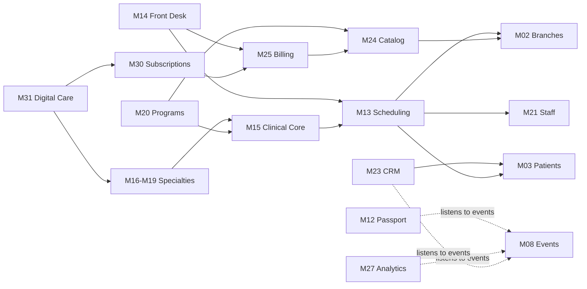

# 03 — قائمة الـModules (تقسيم المنظومة)

> بيرد على: **DEL-02 Modules List** + §8 (Modular) + §11 (Digital Services).
> كل Module له رقم ثابت (M01…M35) بنستخدمه في الـBacklog والـRoadmap.
> العمود **IDs** بيربط الموديول بمتطلبات البريف في [00-requirements-catalog.md](00-requirements-catalog.md).

---

## OXYGEN CORE (الأساس المشترك)

| # | Module | الفولدر | بيعمل إيه | المرحلة | IDs |
|---|---|---|---|---|---|
| M01 | Identity & Access | `iam` | دخول الموظفين (Email + Password + 2FA) ودخول المرضى (OTP)، Sessions، Roles، Permissions، Branch scope | MVP | SEC-01/05/06/07، STF-01 |
| M02 | Organization & Branches | `organization` | الـOrganization، الفروع، الغرف، مواعيد العمل، الإعدادات، العملة والـTimezone | MVP | BR-00/01/02/05 |
| M03 | Patient Registry | `patients` | ملف المريض الأساسي، فصل الحساب عن المريض (جاهز للعيلة)، منع التكرار برقم الموبايل، الموافقات (Consents)، التاريخ المرضي العام | MVP | APP-02، HP-16/17 |
| M04 | Files & Documents | `files` | رفع التحاليل والأشعة والتقارير والصور: Private + لينكات مؤقتة + Thumbnails | MVP | APP-14/15/16، HP-10 |
| M05 | Notification Hub | `notifications` | Push / WhatsApp / SMS / Email، قوالب عربي وإنجليزي، تفضيلات المريض، الجدولة، سجل الإرسال | MVP | NTF-* |
| M06 | Audit & Compliance | `audit` | Audit log، Activity log، تصدير الداتا، سياسات الحفظ والحذف، سجل فتح الملفات الطبية | MVP | SEC-02/09/10/11 |
| M07 | Integrations Hub | `integrations` | Adapters للدفع والرسائل وإعلانات Meta/TikTok والفيديو، وجدول Inbox للـWebhooks | MVP | PAY-10، CRM-01…05 |
| M08 | Events & Jobs | `events` | Outbox، Queues، Scheduler، إعادة المحاولة | MVP | — |

## PATIENT LAYER (واجهات المريض)

| # | Module | الفولدر | بيعمل إيه | المرحلة | IDs |
|---|---|---|---|---|---|
| M09 | Website | `apps/web` | تعريف Oxygen، التخصصات، الأطباء، الفروع، الحجز والدفع، العروض، المحتوى، الفورمز → CRM | MVP | WEB-* |
| M10 | Patient Portal | `apps/web` (`/portal`) | **واجهة المريض في الـMVP** لحد ما التطبيق ينزل: المواعيد، الملفات، الخطط، القياسات، الـPassport، الباقات، الفواتير، الدفع | MVP | WEB-11/12، APP-* |
| M11 | Patient App | `apps/mobile` | التطبيق الواحد لكل التخصصات: نفس خصائص البورتال + Push + البصمة + التمارين من غير نت | بعد الويب (R1.5) | APP-* |
| M12 | Health Passport | `passport` | Timeline موحّد بيتجمع من كل الموديولز، ومتفلتر حسب اللي المريض مسموحله يشوفه | MVP | HP-* |

## CLINIC LAYER (العيادة)

| # | Module | الفولدر | بيعمل إيه | المرحلة | IDs |
|---|---|---|---|---|---|
| M13 | Scheduling & Appointments | `scheduling` | الخدمات ومددها، جداول الأطباء، الإجازات، الغرف، Availability engine، الكالندر، الحالات، التذكيرات، Waiting list (P2) | MVP | APT-* |
| M14 | Front Desk | `front-desk` | تسجيل مريض جديد بسرعة، Check-in، التحصيل (كاش / كارت / لينك دفع)، تقفيل الخزنة اليومي | MVP | IS-01، STF-02 |
| M15 | Clinical Core (EMR) | `clinical` | الزيارات (Encounters)، Form engine، القياسات (Observations)، التشخيصات، الملاحظات، الخطط (Care plans)، التعليمات/الروشتات، التحاليل، توقيع وقفل الزيارة | MVP | CLM-00، HP-* |
| M16 | Nutrition | `specialties/nutrition` | فورم التقييم، Anthropometrics، Body composition، BMI، خطة التغذية، الأهداف، الرسوم البيانية. P2: Food diary، Macros، Adherence | MVP / P2 | NUT-* |
| M17 | Physiotherapy | `specialties/physio` | تقييم أولي، Pain / ROM / Strength / Functional، خطة العلاج، الجلسات، مكتبة تمارين بالفيديو، HEP Builder، إعادة تقييم، Discharge | MVP / P2 | PHY-* |
| M18 | Dermatology | `specialties/dermatology` | Consultation، Skin assessment، خطة العلاج، صور التقدم بموافقة، Timeline. P2: Online follow-up | MVP / P2 | DER-* |
| M19 | Internal Medicine & Metabolic | `specialties/internal-medicine` | Vitals، التحاليل، التشخيصات، الأدوية، المتابعة. P2: متابعة الأمراض المزمنة وتسجيل الضغط والسكر من المريض + تنبيهات | MVP / P2 | IM-* |
| M20 | Programs & Journeys | `programs` | Program builder (مراحل + قواعد)، تسجيل المريض، مرحلته الحالية، تاريخ المراحل. P2: Automations | MVP | PRG-* |
| M21 | Staff Management | `staff` | ملفات الموظفين، التخصص، الفروع، جداول العمل، ربط الموظف بالخدمات | MVP | STF-*، BR-03/04 |
| M22 | Inventory | `inventory` | الأصناف، المخزون لكل فرع، المشتريات، الاستهلاك لكل خدمة، تنبيهات النقص | P3 | INV-* |

## MANAGEMENT LAYER (الإدارة)

| # | Module | الفولدر | بيعمل إيه | المرحلة | IDs |
|---|---|---|---|---|---|
| M23 | CRM & Campaigns | `crm` | Leads من كل المصادر، منع التكرار، توزيع تلقائي على الـAgents، Pipeline Kanban، مكالمات ومهام، SLA، الحملات والـUTM، تحويل Lead لمريض، الـMilestones | MVP | CRM-* |
| M24 | Catalog & Packages | `catalog` | المنتجات: جلسة / باقة / برنامج / اشتراك / عضوية، الأسعار لكل فرع، الـEntitlements (الجلسات المتبقية)، الصلاحية، التجميد | MVP | PKG-* |
| M25 | Billing & Payments | `billing` | الفواتير، المدفوعات (كاش / كارت / أونلاين / على دفعات)، إيصالات PDF، المرتجعات بموافقات، أكواد الخصم، Payment gateway adapter | MVP | PAY-* |
| M26 | Finance Layer | `finance` | تقارير الإيرادات (فرع / خدمة / Digital)، الخصومات، المرتجعات، تقفيلات الخزنة. P2: المصروفات. P3: العمولات + التصدير لبرنامج محاسبة | MVP / P2 / P3 | FIN-* |
| M27 | Analytics & Dashboards | `analytics` | CEO Dashboard، داشبورد لكل فرع، KPIs الـCRM، Patient Journey funnel، تقارير بالفلاتر، Export. P2: Digital Business dashboard | MVP / P2 | DSH-*، JRN-*، RPT-* |
| M28 | Reviews & Satisfaction | `reviews` | طلب تقييم بعد الخدمة، Feedback داخلي (NPS / CSAT)، توجيه المرضى الراضيين لتقييم جوجل، تنبيه عند التقييم الضعيف | P2 | REV-* |
| M29 | Referral Engine | `referrals` | كود لكل مريض، تتبع مين جاب مين، المكافآت والخصومات | P2 | REF-* |

## DIGITAL BUSINESS LAYER (البيزنس الرقمي)

| # | Module | الفولدر | بيعمل إيه | المرحلة | IDs |
|---|---|---|---|---|---|
| M30 | Subscriptions & Memberships | `subscriptions` | Plans (شهري / ربع سنوي / سنوي)، تجديد تلقائي بكارت محفوظ، Grace، Upgrade / Downgrade، إلغاء، إعادة محاولة الدفع، Memberships بمزايا | P2 | SUB-*، DS-28 |
| M31 | Digital Care Products | `digital-care` | Online Nutrition، Physio Home، Derm Follow-up، Chronic Care: متابعة عن بعد + طوابير شغل للفريق + SLA | P2 | DS-01…27 |
| M32 | Content & Education | `content` | مقالات، فيديوهات، مكتبة التمارين، ربط بالتخصص / البرنامج / المرحلة، صفحات العروض | MVP / P2 | CNT-*، WEB-14/16 |
| M33 | Telehealth & Messaging | `telehealth` | MVP: Online consultation بلينك فيديو. P2: فيديو جوه المنصة + محادثة آمنة مع الفريق | MVP / P2 | WEB-06، APP-22، NTF-13 |
| M34 | Corporate & Family | `corporate` | حسابات الشركات وموظفيها، العقود، فوترة الشركات، وإدارة أفراد الأسرة | P3 | DS-29/30، APP-03 |
| M35 | AI Services | `ai` | تسجيل الأكل بالصورة، مساعد تثقيفي، تلخيص الزيارات، مساعد إداري، تذكيرات ذكية، تحليلات — كلها بحدود وصلاحيات | P3 | AI-* |

---

## خريطة الاعتماد بين الموديولز (مبسطة)

كل الموديولز بتعتمد على CORE (M01–M08). الرسم ده بيوضح الاعتمادات المهمة بس:

---

## الـSpecialty Plugin Contract: إزاي التخصص بيتركّب على النظام

الـClinical Core (M15) **ميعرفش حاجة عن أي تخصص**. كل تخصص بيسجّل نفسه بـ`SpecialtyDefinition` فيها:

| المكون | مثال من الـPhysiotherapy |
|---|---|
| Form templates | Initial assessment، Session note، Reassessment، Discharge |
| Observation types | `pain_nrs` (0–10)، `rom_knee_flexion` (درجات)، `grip_strength` (kg) |
| Plan types | Treatment plan، Home exercise program |
| Plan item types | Exercise (sets، reps، hold، frequency، video) |
| Default services | Initial assessment 60 دقيقة، Session 45 دقيقة |
| Default programs | Post-op knee rehab (بمراحل) |
| Patient app widgets | HEP player، Pain log |
| Dashboard widgets | ROM progress chart، Adherence |
| Notification templates | Exercise reminder |
| Permissions | `clinical.physio.read` / `clinical.physio.write` |

### إضافة تخصص جديد (مثال: Dentistry) — من غير ما نعيد بناء النظام

1. **Admin:** يضيف الـSpecialty + الخدمات بمددها وأسعارها.
2. **Admin:** يبني الـForm templates من الـForm builder.
3. **Admin:** يعرّف Observation types جديدة لو محتاجة.
4. يربط الأطباء بالتخصص والخدمات ويحط جداولهم.
5. الصلاحيات: `clinical.dentistry.*` على Role جديد أو موجود.
6. **(اختياري)** لو التخصص محتاج شاشة مخصوصة (زي رسم الأسنان) بنعمل Module صغير `specialties/dentistry` بنفس الـContract.

الداتابيز الأساسية وباقي الموديولز مش هيتعدلوا.

---

## المنتجات الرقمية = تركيبة من موديولز موجودة

ده اللي بيخلي الـDigital Business (§11) سريع في التنفيذ في Phase 2: مفيش منتج بيتبني من الصفر.

| المنتج الرقمي | بيتكون من |
|---|---|
| **Oxygen Online Nutrition** | اشتراك (M30) + Online assessment (M15/M16) + خطة التغذية (M16) + Food diary والـMacros (M16) + محادثة (M33) + محتوى (M32) + تذكيرات (M05) |
| **Oxygen Physio Home** | اشتراك + HEP (M17) + فيديوهات التمارين (M32) + تسجيل التنفيذ والألم (M17) + طابور مراجعة للـPhysio (M31) + تذكيرات |
| **Oxygen Derm Follow-up** | اشتراك + صور التقدم بموافقة (M18) + Online follow-up (M33) + Timeline (M12) + تذكيرات |
| **Chronic Care / Metabolic** | اشتراك + المريض بيسجل الضغط والسكر والوزن (M19) + التحاليل (M04/M15) + قايمة الأدوية (M15) + حدود تنبيه (M31) + متابعة |
| **Oxygen Membership** | اشتراك + مزايا (خصومات على الخدمات، جلسات مجانية، وصول للمحتوى الرقمي) (M24/M30) |

### طوابير الشغل للفريق (Digital Care Queues)

المنتج الرقمي بيفشل لو الفريق الطبي معندوش طريقة واضحة يتابع بيها. عشان كده M31 بيدي لكل أخصائي **Inbox**:

- يوميات أكل مستنية مراجعة (Online Nutrition).
- برامج HEP مستنية Review، ومرضى الألم عندهم بيزيد (Physio Home).
- صور جلد مستنية رد (Derm Follow-up).
- قراءات ضغط/سكر عدّت الحد (Chronic Care).

وكل عنصر عليه **SLA** (مثلاً رد خلال 24 ساعة)، والتأخير بيظهر في داشبورد المدير.
