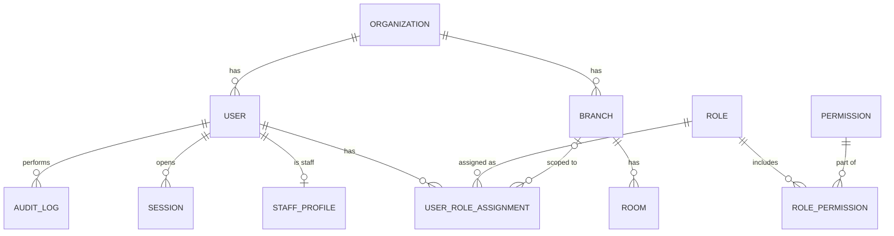
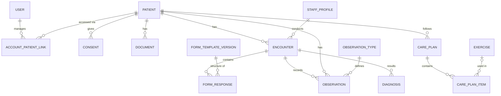
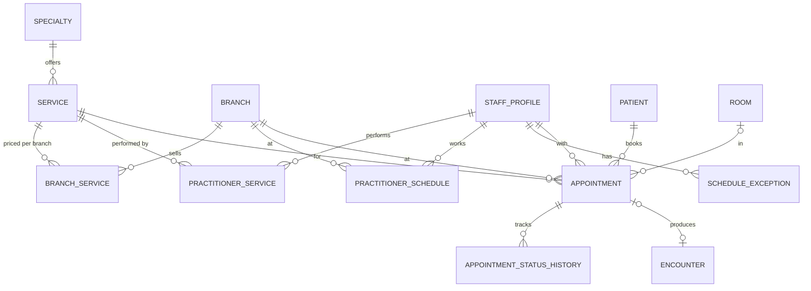
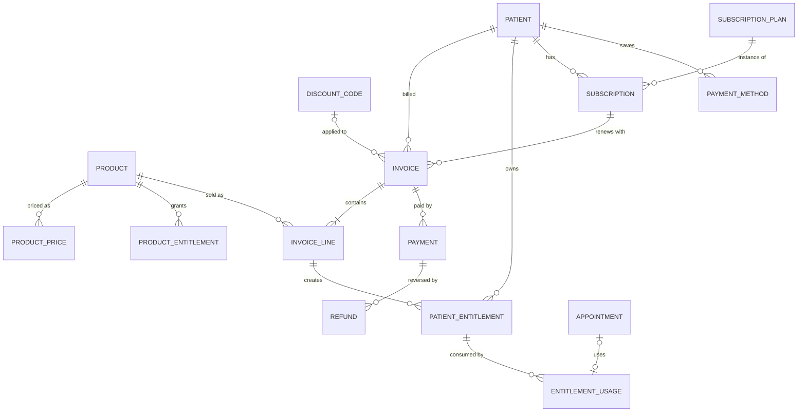
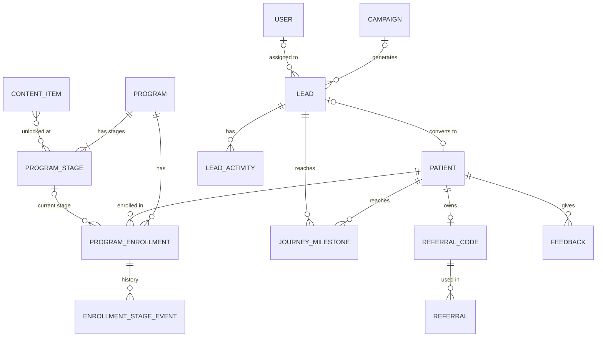

# 04 — Database Structure المقترحة

> بيرد على: **DEL-03 Database structure** + §5 (Multi-branch) + §27 (قابلية التوسع).
> ده تصميم مبدئي (Logical model). الـSchema النهائية (Prisma) بتتكتب في Phase 4 بعد الـSRS.

---

## 1. قواعد عامة لكل الجداول

| القاعدة | التفاصيل | ليه |
|---|---|---|
| **IDs** | UUIDv7 | بيترتب بالوقت، وآمن في الـURLs، ومينفعش حد يخمّن ID مريض تاني |
| **`organization_id`** | في كل جدول | جاهزين لـSaaS من غير Migration (§27) |
| **`branch_id`** | في كل جدول بيخص فرع | Multi-branch من أول يوم (§5) |
| **Timestamps** | `created_at`، `updated_at`، `created_by`، `updated_by` | التتبع |
| **الحذف** | Soft delete للبيانات التشغيلية. **البيانات الطبية مبتتمسحش**: التعديل بيعمل Amendment بتاريخ، والحذف = إخفاء + Audit | قانونيًا وطبيًا |
| **الفلوس** | `integer` بأصغر وحدة (قروش/سنتات) + `currency` — **مفيش float أبدًا** | مفيش أخطاء تقريب |
| **الوقت** | `timestamptz` بالـUTC، والعرض بتوقيت الفرع (IANA زي `Africa/Cairo`) | مصر رجعت للتوقيت الصيفي من 2023، فمينفعش نثبّت +2 |
| **الموبايل** | صيغة E.164 (`+2010…`) | منع التكرار + واتساب + SMS |
| **البحث بالعربي** | عمود `search_name` متوحّد (أ/إ/آ ← ا، ة ← ه، ى ← ي، من غير تشكيل) + Index بـ`pg_trgm` | "أحمد" و"احمد" يطلعوا نفس النتيجة |
| **JSONB** | للحاجات المرنة فعلًا بس (ردود الفورمز الطبية، الإعدادات) | أي حاجة هنعمل عليها تقارير بتبقى عمود عادي |

---

## 2. مجموعات الجداول (Domains)

| # | Domain | الجداول | Module |
|---|---|---|---|
| 1 | Organization & Access | `organizations`، `branches`، `rooms`، `users`، `staff_profiles`، `roles`، `permissions`، `role_permissions`، `user_role_assignments`، `sessions` | M01، M02، M21 |
| 2 | Patients | `patients`، `account_patient_links`، `consents`، `patient_allergies`، `patient_conditions`، `patient_medications`، `documents`، `files` | M03، M04 |
| 3 | Scheduling | `specialties`، `services`، `branch_services`، `practitioner_services`، `practitioner_schedules`، `schedule_exceptions`، `room_services`، `appointments`، `appointment_status_history`، `waiting_list_entries` (P2) | M13 |
| 4 | Clinical | `encounters`، `form_templates`، `form_template_versions`، `form_responses`، `observation_types`، `observations`، `diagnoses`، `clinical_notes`، `care_plans`، `care_plan_items`، `exercises`، `prescriptions`، `photo_sets`، `exercise_logs` (P2)، `food_diary_entries` (P2) | M15–M19 |
| 5 | Programs | `programs`، `program_stages`، `program_enrollments`، `enrollment_stage_events` | M20 |
| 6 | Commerce | `products`، `product_prices`، `product_entitlements`، `invoices`، `invoice_lines`، `payments`، `refunds`، `discount_codes`، `discount_redemptions`، `patient_entitlements`، `entitlement_usages`، `payment_methods`، `cash_sessions` | M24، M25 |
| 7 | Subscriptions | `subscription_plans`، `subscriptions`، `subscription_events` — **بتتعمل من الـMVP** حتى لو الشاشات في P2 | M30 |
| 8 | CRM | `campaigns`، `leads`، `lead_activities`، `tasks`، `journey_milestones`، `referral_codes`، `referrals` | M23، M29 |
| 9 | Engagement | `notification_templates`، `notifications`، `notification_preferences`، `message_threads` و`messages` (P2)، `feedback` (P2)، `content_items`، `content_links` | M05، M28، M32، M33 |
| 10 | Finance | `expenses` (P2)، `commissions` (P3) | M26 |
| 11 | Inventory (P3) | `inventory_items`، `stock_levels`، `stock_movements`، `purchase_orders`، `service_consumables` | M22 |
| 12 | Corporate (P3) | `corporate_accounts`، `corporate_members`، `corporate_contracts` | M34 |
| 13 | System | `audit_logs`، `activity_logs`، `outbox_events`، `webhook_inbox`، `settings`، `feature_flags`، `kpi_daily` | M06، M08، M27 |

---

## 3. الرسومات (ERD) لكل Domain

### 3.1 Organization & Access



> `USER_ROLE_ASSIGNMENT.branch_id = NULL` معناها الصلاحية على **كل الفروع** (زي الـCEO). غير كده بتبقى على فرع معيّن.

### 3.2 Patients & Clinical



> **فصل الحساب عن المريض (`ACCOUNT_PATIENT_LINK`):** الحساب = اللي بيعمل Login، والمريض = الشخص اللي ليه ملف طبي.
> النهارده كل حساب مربوط بمريض واحد (`relationship = self`). لما ييجي **Family Account** (P3) الأم هتضيف أولادها بسطر جديد في نفس الجدول، من غير أي Migration.

### 3.3 Scheduling



### 3.4 Commerce (Catalog + Billing + Subscriptions)



> **الفكرة اللي بتحل §10 كله:** أي منتج (جلسة / باقة / برنامج / اشتراك / عضوية) بيتباع كسطر في فاتورة، والسطر ده بيعمل **Entitlement** للمريض فيه:
> العدد الكلي، المستخدم، المتبقي، تاريخ الانتهاء، والحالة.
> وكل جلسة بتخلص بتعمل `ENTITLEMENT_USAGE` مربوط بالموعد. كده "Price / Paid / Used / Remaining / Expiry" بيتحسبوا لوحدهم.

### 3.5 Programs + CRM + Engagement



---

## 4. أهم الجداول بالتفصيل

### `patients`

```text
patients
  id                      uuid  PK
  organization_id         uuid  FK
  mrn                     text  UNIQUE per org      -- رقم الملف: OXY-000123
  first_name, last_name   text
  full_name_ar            text
  search_name             text  GIN trigram index   -- الاسم متوحّد للبحث
  gender                  text
  date_of_birth           date
  phone_e164              text  INDEX               -- مش UNIQUE: أفراد العيلة ممكن يشتركوا في رقم
  email                   citext
  national_id             text  ENCRYPTED
  primary_branch_id       uuid  FK
  source_lead_id          uuid  FK NULL
  referred_by_patient_id  uuid  FK NULL
  status                  active | inactive | merged
  merged_into_id          uuid  NULL                -- لو اتدمج ملفين مكررين
```

### `appointments`

```text
appointments
  id, organization_id, branch_id
  patient_id              FK
  practitioner_id         FK staff_profiles
  room_id                 FK NULL
  service_id              FK
  starts_at, ends_at      timestamptz
  status                  booked | confirmed | checked_in | in_progress | completed
                          | cancelled | no_show | rescheduled
  type                    in_person | online
  source                  website | app | reception | crm | whatsapp
  booked_by_user_id       FK NULL
  rescheduled_from_id     FK NULL                   -- الموعد القديم لو اتأجل
  entitlement_id          FK NULL                   -- الباقة اللي هتتخصم منها الجلسة
  video_link              text NULL
  cancel_reason, notes
  checked_in_at, completed_at
```

### Clinical: `encounters` + Form Engine

```text
encounters
  id, organization_id, branch_id
  patient_id, practitioner_id, specialty_id
  appointment_id          FK NULL                   -- NULL للمتابعة الأونلاين
  type                    assessment | follow_up | session | reassessment | discharge | online_review
  status                  draft | signed | amended
  signed_at, signed_by
  summary_for_patient     text                      -- اللي يظهر في التطبيق
  patient_visible         bool

form_templates            (specialty_id, code, name, current_version)
form_template_versions    (template_id, version, schema jsonb, ui_schema jsonb, published_at)
form_responses            (encounter_id, template_version_id, data jsonb, patient_visible)
```

> كل رد على فورم مربوط بـ**نسخة** الفورم اللي اتملى بيها. لو عدّلنا فورم الـPhysio السنة الجاية، الملفات القديمة هتفضل بتتعرض صح.

### `observations` — كل القياسات في جدول واحد

```text
observation_types   (code, name_ar, name_en, unit, value_type, min, max, loinc_code, specialty_id NULL)

observations
  id, organization_id, patient_id
  type_code       weight | height | bmi | body_fat_pct | muscle_mass | waist
                  | bp_systolic | bp_diastolic | glucose | hba1c | pain_nrs | rom_knee_flexion …
  value_num       numeric
  value_text      text NULL
  unit            text
  measured_at     timestamptz
  source          clinic | patient | device
  encounter_id    FK NULL
  recorded_by     FK NULL
  patient_visible bool
  INDEX (patient_id, type_code, measured_at DESC)
```

> جدول واحد لكل القياسات = **Weight history وBody composition وBP وGlucose وPain وROM** كلهم بيترسموا بنفس الكود،
> وأي تخصص جديد بيضيف `observation_type` بس. والقياس اللي المريض بيسجله من التطبيق (P2) بيتسجل بـ`source = patient`.

### Care Plans + Exercises

```text
care_plans        (patient_id, specialty_id,
                   type: nutrition_plan | treatment_plan | hep | derm_regimen | medication_plan,
                   status: draft | active | completed | cancelled,
                   starts_on, ends_on, content jsonb, published_at, patient_visible)
care_plan_items   (plan_id, kind: exercise | meal | instruction | medication | goal,
                   ref_id, params jsonb {sets, reps, hold_sec, frequency}, sort_order)
exercises         (name_ar, name_en, body_region, video_file_id, instructions_ar, instructions_en, equipment)
```

### Programs

```text
programs                 (code, name, product_id NULL, status)
program_stages           (program_id, sort_order, code, name, expected_days,
                          entry_rules jsonb, actions jsonb)   -- مثلاً: أول ما يدخل المرحلة ابعت محتوى X واحجز متابعة
program_enrollments      (program_id, patient_id, branch_id, current_stage_id, owner_practitioner_id,
                          status: active | paused | completed | dropped, started_at, completed_at)
enrollment_stage_events  (enrollment_id, from_stage_id, to_stage_id, changed_by, changed_at, note)
```

### Commerce

```text
products
  id, code, name_ar, name_en
  type                single_session | package | program | subscription | membership | digital
  specialty_id        NULL
  validity_days       NULL           -- صلاحية الباقة
  is_online_sellable  bool
  status

product_prices        (product_id, branch_id NULL = كل الفروع, currency, amount_minor, valid_from, valid_to)
product_entitlements  (product_id, kind: service_sessions | discount_pct | digital_access | free_service,
                       service_id NULL, quantity NULL, value NULL)

invoices              (number, patient_id, branch_id,
                       status: draft | issued | partially_paid | paid | void | refunded,
                       subtotal, discount_total, tax_total, total, currency, issued_at, due_at)
invoice_lines         (invoice_id, product_id, description, qty, unit_price, discount, total)
payments              (invoice_id, method: cash | card_pos | online | wallet | bank_transfer,
                       provider, provider_ref UNIQUE, amount, status, paid_at, received_by)
refunds               (payment_id, amount, reason,
                       status: requested | approved | rejected | processed, requested_by, approved_by)
discount_codes        (code UNIQUE, type: percent | fixed, value, max_uses, per_patient_limit,
                       valid_from, valid_to, applies_to jsonb, campaign_id)

patient_entitlements  (patient_id, invoice_line_id, product_id, service_id,
                       total_qty, used_qty, remaining_qty GENERATED,
                       starts_at, expires_at,
                       status: pending_payment | active | frozen | exhausted | expired | refunded)
entitlement_usages    (entitlement_id, appointment_id UNIQUE, used_at, reversed_at NULL)
cash_sessions         (branch_id, opened_by, opened_at, closed_by, closed_at,
                       expected_cash, counted_cash, difference)
```

### Subscriptions (الجداول من MVP — الشاشات P2)

```text
subscription_plans    (product_id, interval: month | quarter | year, price, trial_days, grace_days,
                       auto_renew_default, features jsonb)
subscriptions         (patient_id, plan_id,
                       status: trialing | active | past_due | grace | pending_cancel | cancelled | expired,
                       current_period_start, current_period_end, auto_renew, cancel_at_period_end,
                       payment_method_id, channel: web | clinic | app_store | google_play,
                       started_at, cancelled_at)
subscription_events   (subscription_id,
                       type: created | renewed | payment_failed | upgraded | downgraded | cancelled | expired | resumed,
                       data jsonb, at)
payment_methods       (patient_id, provider, token ENCRYPTED, brand, last4, expiry, is_default)
```

> العمود `channel` موجود عشان لو اضطرينا نبيع اشتراكات من جوه التطبيق عن طريق Apple/Google (شوف [12-risks.md](12-risks.md)).

### CRM + Journey

```text
campaigns         (name, channel: facebook | instagram | tiktok | google | offline | other,
                   external_id, budget_minor, starts_on, ends_on, utm_campaign)

leads
  id, organization_id, branch_id
  full_name, phone_e164 INDEX, email
  source            facebook | instagram | tiktok | website | whatsapp | phone | referral | walk_in | other
  campaign_id       FK NULL
  utm_source, utm_medium, utm_campaign, utm_content, utm_term, landing_page, external_lead_id
  interest_specialty_id, interest_product_id
  assigned_to       FK users NULL
  stage             -- أعلى Milestone وصلها
  status            open | won | lost
  lost_reason
  patient_id        FK NULL                 -- بعد التحويل لمريض
  referred_by_patient_id NULL
  first_contacted_at, last_activity_at, next_follow_up_at

lead_activities   (lead_id, type: call | whatsapp | sms | email | note | meeting,
                   direction, outcome, notes, by_user, at)
tasks             (assignee, related_type, related_id, title, due_at, done_at, priority)

journey_milestones
  id, organization_id
  lead_id NULL, patient_id NULL             -- واحد منهم على الأقل
  milestone         LEAD_CREATED | CONTACTED | QUALIFIED | BOOKED | VISITED | ASSESSED
                    | PROGRAM_STARTED | PAID | TREATMENT_STARTED | FOLLOW_UP
                    | RESULT_ACHIEVED | RENEWED | REFERRED | LOST
  occurred_at
  branch_id, amount_minor NULL, ref_type, ref_id, source_event_id
```

> ده الجدول اللي بيجاوب كل أسئلة §7 و§16: "هل حجز؟ هل حضر؟ دفع كام؟ هل جدد؟" — كل إجابة = Milestone بتاريخها.
> وبيه بنرسم الـFunnel ونعرف "أين نفقد المرضى".

### System

```text
audit_logs        (id, at, actor_user_id, actor_type, action: create | update | delete | view | export | login …,
                   entity_type, entity_id, patient_id NULL, branch_id, before jsonb, after jsonb,
                   ip, user_agent, reason)          -- مقسّم شهريًا + Append-only
outbox_events     (id, type, payload jsonb, occurred_at, processed_at, attempts)
webhook_inbox     (provider, external_id UNIQUE, payload, received_at, processed_at)
kpi_daily         (date, branch_id, metric, value)  -- أرقام مجمّعة للداشبورد
```

---

## 5. قيود مهمة على مستوى الداتابيز (مش بس في الكود)

### منع الحجز المزدوج — مستحيل حتى لو اتنين حجزوا في نفس الثانية

```sql
CREATE EXTENSION IF NOT EXISTS btree_gist;

ALTER TABLE appointments
  ADD CONSTRAINT no_practitioner_overlap
  EXCLUDE USING gist (
    practitioner_id WITH =,
    tstzrange(starts_at, ends_at, '[)') WITH &&
  )
  WHERE (status IN ('booked', 'confirmed', 'checked_in', 'in_progress'));

ALTER TABLE appointments
  ADD CONSTRAINT no_room_overlap
  EXCLUDE USING gist (
    room_id WITH =,
    tstzrange(starts_at, ends_at, '[)') WITH &&
  )
  WHERE (room_id IS NOT NULL AND status IN ('booked', 'confirmed', 'checked_in', 'in_progress'));
```

> Prisma مبيعرفش يكتب النوع ده من القيود، فبيتحط في Migration بـSQL يدوي.

### قيود تانية

| القيد | بيمنع إيه |
|---|---|
| `payments.provider_ref UNIQUE` | نفس الدفعة تتسجل مرتين لو الـWebhook وصل مرتين |
| `entitlement_usages.appointment_id UNIQUE` | الجلسة تتخصم من الباقة مرتين |
| `CHECK (used_qty <= total_qty)` | الباقة تتخصم أكتر من رصيدها |
| `webhook_inbox (provider, external_id) UNIQUE` | معالجة نفس الـWebhook مرتين |
| صلاحيات الداتابيز على `audit_logs`: `INSERT` بس | أي حد يعدّل أو يمسح الـAudit log |

---

## 6. Indexes أساسية

| الجدول | Index |
|---|---|
| `patients` | `(organization_id, phone_e164)` + GIN trigram على `search_name` |
| `appointments` | `(branch_id, starts_at)` · `(practitioner_id, starts_at)` · `(patient_id, starts_at)` |
| `observations` | `(patient_id, type_code, measured_at DESC)` |
| `leads` | `(organization_id, phone_e164)` · `(assigned_to, status)` · `(stage)` |
| `journey_milestones` | `(milestone, occurred_at)` · `(patient_id)` |
| `invoices` | `(branch_id, issued_at)` |
| `audit_logs` | `(patient_id, at)` — مع Partitioning شهري |

---

## 7. التقارير والـKPIs من غير ما النظام يبطّأ

1. **Live:** أرقام "النهارده" بتتحسب مباشرة (حجمها صغير).
2. **`kpi_daily`:** Worker بيحسب الأرقام المجمّعة كل ساعة وكل ليلة، والداشبورد بيقرأ منها.
3. **Read replica (P2):** التقارير التقيلة بتقرأ من نسخة تانية، فمتأثرش على الريسبشن.
4. **Data warehouse (P3):** لو الحجم كبر جدًا.

---

## 8. جاهزين للمعايير الطبية من دلوقتي

الموديل مستوحى من **HL7 FHIR**:
`Patient` · `Encounter` · `Observation` · `Condition` (التشخيصات) · `CarePlan` · `DocumentReference` · `Appointment`.

- القياسات ممكن تحمل كود **LOINC** (مثلاً: الوزن `29463-7`، الطول `8302-2`، BMI `39156-5`، الضغط `8480-6` / `8462-4`).
- التشخيصات ممكن تحمل كود **ICD-10**.

ده مش مطلوب في الـMVP، لكن تكلفته صفر دلوقتي، وبيسهّل أي ربط بعدين مع معامل أو مستشفيات أو شركات تأمين.

---

## 9. حجم البيانات المتوقع (تقديري)

| البيان | الحساب | الحجم في السنة |
|---|---|---|
| المواعيد | 5 فروع × 60 موعد/يوم × 365 | ~110 ألف — صغير جدًا على PostgreSQL |
| القياسات | ~10 قياسات لكل زيارة | ~1 مليون صف — عادي |
| الـAudit log | كل فتح وتعديل | ملايين — عشان كده Partitioning شهري |
| الملفات (تحاليل / أشعة / صور / فيديو) | الأكبر | مئات الـGB على مدار سنين — في Object Storage مش في الداتابيز |
