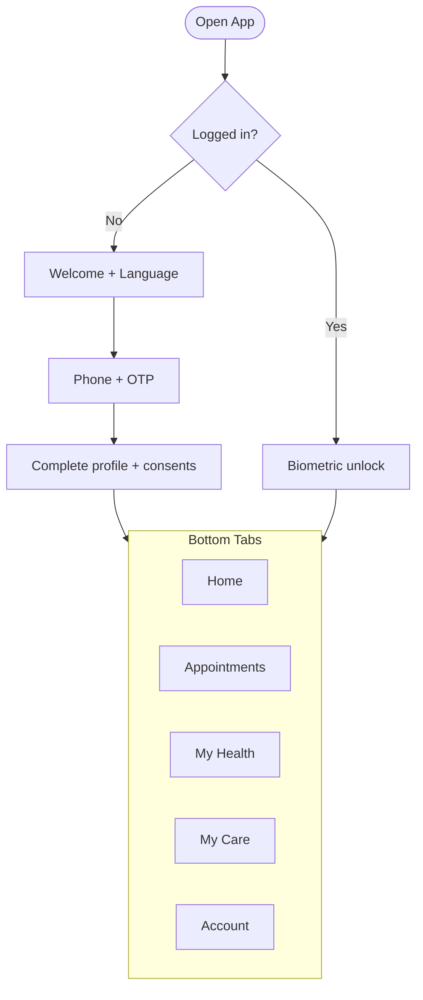

# 05 — Web / App / Dashboard Structure

> بيرد على: **DEL-04 Web/App/Dashboard structure** + §1 + §2 + §15.
> الـIDs اللي هنا (W-xx / PP-xx / A-xx / D-xx) هي اللي هنكمل عليها في الـSRS: كل شاشة هيتكتب لها وصف تفصيلي.

---

## نظرة عامة: 3 واجهات وAPI واحد

| الواجهة | العنوان المقترح | مين بيستخدمها | التقنية |
|---|---|---|---|
| Website + Patient Portal | `www.<domain>` و `<domain>/portal` | الجمهور والمرضى | Next.js |
| Staff Dashboard | `staff.<domain>` | كل الموظفين | React + Vite + antd |
| Patient App (بعد الويب) | App Store + Google Play | المرضى | Expo |
| API | `api.<domain>` | الواجهات التلاتة | NestJS |

> الداشبورد على Subdomain منفصل عشان نقدر نحط عليه حماية إضافية (مثلاً جلسة أقصر، أو تقييد بالـIP / Cloudflare Access لو حبينا).
> **النظام Separate:** كل واجهة أبلكيشن لوحده في نفس Repo الفرونت (`apps/web` · `apps/dashboard` · `apps/mobile`)، والمشترك الحقيقي بس في `packages/` — [01](01-tech-stack.md).

---

## 1. الـWebsite

### خريطة الموقع (Sitemap)

```text
/{ar|en}
├── /                         Home
├── /about                    عن Oxygen
├── /specialties              التخصصات
│   └── /[slug]               Nutrition · Physiotherapy · Dermatology · Internal Medicine
├── /services/[slug]          صفحة الخدمة
├── /programs/[slug]          البرامج (Secret Seven …)
├── /digital                  البرامج والاشتراكات الرقمية   (P2 — في الـMVP صفحة اهتمام)
│   └── /[slug]               Online Nutrition · Physio Home · Derm Follow-up · Chronic Care
├── /membership               العضويات                        (P2)
├── /doctors                  الأطباء والفريق
│   └── /[slug]
├── /branches                 الفروع
│   └── /[slug]               خريطة · مواعيد · خدمات · أطباء
├── /book                     الحجز (Wizard)
├── /online-consultation      الاستشارة الأونلاين
├── /offers/[slug]            العروض و Landing pages الحملات
├── /learn                    المحتوى والتثقيف
│   └── /[slug]
├── /contact                  تواصل + WhatsApp
├── /app                      تحميل التطبيق
├── /checkout                 الدفع  →  /success · /failed
├── /login                    دخول بالـOTP
├── /portal/…                 Patient Portal
└── /privacy · /terms · /refund-policy · /medical-disclaimer · /delete-account
```

### خطوات الحجز من الويبسايت

1. التخصص أو الخدمة
2. الفرع
3. الطبيب (أو "أي طبيب متاح") والميعاد
4. بيانات المريض + تأكيد الموبايل بـOTP
5. الدفع (لو الخدمة محتاجة دفع مقدم) أو التأكيد مباشرة
6. صفحة نجاح + إضافة للتقويم + لينك تحميل التطبيق

### Patient Portal

`/portal` (ملخص) · `/portal/appointments` · `/portal/passport` · `/portal/documents` · `/portal/plans` · `/portal/packages` · `/portal/invoices` · `/portal/profile` · `/portal/settings` (الخصوصية، تصدير البيانات، حذف الحساب)

### ربط الويبسايت بالنظام (WEB-19)

- صفحات الخدمات والأطباء والفروع **بتتولد من الداتابيز** (Catalog + Staff + Branches). الـAdmin يعدّل من الداشبورد، والصفحة تتحدث لوحدها (On-demand revalidation).
- أي فورم بيعمل **Lead** في الـCRM ومعاه الـUTM والصفحة اللي جه منها.
- الحجز بيستخدم نفس الـAvailability engine بتاع الريسبشن.

---

## 2. الـPatient App

> **بييجي بعد الويب.** لحد ما ينزل، المريض بيعمل كل ده من الـPatient Portal على الويب (وبيشتغل كويس على متصفح الموبايل).

### الهيكل



### التابات والشاشات

| التاب | جواه إيه | المرحلة |
|---|---|---|
| **Home** | الموعد الجاي، مرحلة البرنامج الحالية، مهام النهارده (تمارين، تسجيل وزن)، الجلسات المتبقية، العروض | MVP |
| **Appointments** | المواعيد الجاية والسابقة، حجز جديد، تأجيل / إلغاء، تفاصيل الموعد واتجاهات الفرع، دخول الاستشارة الأونلاين | MVP |
| **My Health** (Health Passport) | الـTimeline، القياسات والرسوم (وزن، Body composition، ضغط، سكر)، الخطط (تغذية، علاج طبيعي، جلدية، أدوية)، الملفات (تحاليل، أشعة، تقارير، تعليمات). P2: الصور | MVP |
| **My Care** | برامجي ومرحلتي، Home Exercise (مشغّل التمارين بالفيديو). P2: Food diary والـMacros، تسجيل الضغط والسكر، المحتوى التعليمي، المحادثة مع الفريق | MVP / P2 |
| **Account** | البروفايل، الباقات والاشتراكات (المتبقي والصلاحية والتجديد)، المدفوعات والفواتير، الإشعارات، اللغة، الخصوصية (تصدير / حذف الحساب)، الدعم. P2: Referral. P3: أفراد العيلة | MVP |

### مبادئ تجربة المريض

- **عربي أولًا (RTL)** مع إنجليزي كامل.
- مناسب لكل الأعمار: خطوط كبيرة وبتكبر مع إعدادات الموبايل، وأزرار واضحة.
- الإشعار يفتح الشاشة الصح على طول (Deep links).
- الخطط وبرنامج التمارين بيتشافوا من غير نت (Cache).
- دخول بالبصمة أو الوش بعد أول مرة.

---

## 3. الـStaff Dashboard

### الشكل العام

- مبني بـ**antd** (عربي RTL + ألوان Oxygen من الـDesign tokens).
- **Sidebar** بيظهر فيه بس اللي مسموح للموظف بيه.
- **Top bar:** اختيار الفرع · بحث سريع عن مريض (بالاسم / الموبايل / رقم الملف) · الإشعارات · الحساب.
- **على الموبايل:** Executive Dashboard و My Day والكالندر بيشتغلوا Responsive، والداشبورد بيتسطب كـPWA على موبايل الدكاترة والـCEO.

### أول شاشة لكل دور

| الدور | أول شاشة |
|---|---|
| Reception | Today Board |
| Doctor / Nutrition / Physio | My Day |
| CRM Agent | My Leads |
| Branch Manager | Branch Dashboard |
| CEO | Executive Dashboard |
| Admin | Settings |

### أقسام الـSidebar

```text
Home                  (حسب الدور)
Calendar              Day / Week · by Practitioner / Room
Front Desk            Check-in queue · Registration · Payments (POS) · Cash closing
Patients              Search · Patient 360
Clinical              My encounters · Form templates · Exercise library
Programs              Program builder · Enrollments board
CRM                   Pipeline · Leads · Tasks · Campaigns
Catalog               Services · Products & Packages · Plans (P2) · Discount codes
Billing & Finance     Invoices · Payments · Refunds · Revenue · Expenses (P2)
Dashboards            Executive · Branch · Patient Journey · Digital Business (P2)
Reports               Report builder + Export
Content               Articles · Videos · Offer pages
Digital Care (P2)     Queues · Subscriptions · Messages
Reviews (P2)
Inventory (P3)
Settings              Branches · Rooms · Hours · Staff · Roles · Templates · Notifications · Integrations · Audit log
```

### أهم 4 شاشات

**Patient 360** — أهم شاشة في النظام كله
- **Header:** الاسم، السن، رقم الملف، الموبايل، الفرع + تنبيهات (حساسية، مرحلة البرنامج، الجلسات المتبقية، مبالغ متأخرة).
- **Tabs:** Overview · Timeline · Encounters · Measurements · Plans · Documents & Photos · Programs · Billing & Packages · CRM & Communications · Consents · Access log.
- كل Tab بيظهر حسب صلاحية الموظف (الريسبشن مثلًا مش هيشوف Encounters).

**Today Board (Reception)**
- أعمدة حسب الحالة: Expected · Checked-in · With clinician · Completed · No-show.
- أزرار سريعة: Check-in · تحصيل · حجز متابعة.

**Calendar**
- عمود لكل طبيب (أو لكل غرفة)، ألوان حسب الحالة والتخصص.
- Drag & drop للتأجيل، قفل أوقات، فلاتر (فرع / تخصص / طبيب).

**CRM Pipeline**
- Kanban: عمود لكل مرحلة.
- كارت الـLead: الاسم، أيقونة المصدر، الحملة، الـAgent، عداد الـSLA، آخر تواصل.
- لما تفتحه: Timeline التواصل، تسجيل مكالمة، إرسال رسالة واتساب جاهزة، حجز موعد، تحويل لمريض.

### شكل الـExecutive Dashboard (تخطيطي)

```text
┌──────────────────────────────────────────────────────────────────┐
│ Executive Dashboard     [Today v]  [All branches v]  [Compare]   │
├──────────┬──────────┬──────────┬──────────┬──────────┬───────────┤
│ Patients │ New pts  │ Leads    │ Appts    │ No-shows │ Revenue   │
├──────────┴──────────┴──────────┼──────────┴──────────┴───────────┤
│ Revenue trend                  │ Branch comparison               │
├────────────────────────────────┼─────────────────────────────────┤
│ CRM funnel                     │ Top services · Staff table      │
├────────────────────────────────┴─────────────────────────────────┤
│ Digital: MRR · Active subscribers · Churn · Renewal rate   (P2)  │
└──────────────────────────────────────────────────────────────────┘
```

---

## 4. جرد الشاشات (Screen Inventory)

**اختصارات الأدوار:** REC = Reception · CLIN = Doctor / Nutrition / Physio · DOC = Doctor · NUT = Nutrition · PHY = Physio · AST = Assistant · CRM = CRM Agent · MKT = Marketing · FIN = Finance · BM = Branch Manager · OPS = Operations Manager · CEO · ADM = Admin

### Website (W) و Portal (PP)

| ID | الشاشة | المرحلة |
|---|---|---|
| W-01 | Home | MVP |
| W-02 | About | MVP |
| W-03 | التخصصات + صفحة كل تخصص | MVP |
| W-04 | صفحة الخدمة | MVP |
| W-05 | الأطباء + بروفايل الطبيب | MVP |
| W-06 | الفروع + صفحة الفرع | MVP |
| W-07 | Booking wizard | MVP |
| W-08 | Online consultation | MVP |
| W-09 | صفحة البرامج (Secret Seven) | MVP |
| W-10 | البرامج الرقمية والأسعار | P2 (MVP: فورم اهتمام) |
| W-11 | Membership | P2 |
| W-12 | العروض و Landing pages | MVP |
| W-13 | Learn (مقالات) | MVP |
| W-14 | Contact + WhatsApp | MVP |
| W-15 | تحميل التطبيق | MVP |
| W-16 | Checkout + النتيجة | MVP |
| W-17 | Login (OTP) | MVP |
| W-18 | الصفحات القانونية + حذف الحساب | MVP |
| PP-01 | Portal: ملخص | MVP |
| PP-02 | Portal: المواعيد | MVP |
| PP-03 | Portal: Health Passport | MVP |
| PP-04 | Portal: الملفات | MVP |
| PP-05 | Portal: الخطط | MVP |
| PP-06 | Portal: الباقات والاشتراكات | MVP / P2 |
| PP-07 | Portal: الفواتير | MVP |
| PP-08 | Portal: البروفايل والخصوصية | MVP |

### Patient App (A)

> التطبيق نفسه بينزل في **R1.5 بعد الويب**. عمود المرحلة هنا = إمتى الخاصية تبقى متاحة للمريض، ولحد ما التطبيق ينزل بتبقى في البورتال (PP-xx).

| ID | الشاشة | المرحلة |
|---|---|---|
| A-01 | Welcome + اللغة | MVP |
| A-02 | Login (OTP) | MVP |
| A-03 | استكمال البروفايل + الموافقات | MVP |
| A-04 | Home | MVP |
| A-05 | قايمة المواعيد | MVP |
| A-06 | Booking wizard | MVP |
| A-07 | تفاصيل الموعد / تأجيل / إلغاء | MVP |
| A-08 | دخول الاستشارة الأونلاين | MVP (لينك) / P2 (جوه التطبيق) |
| A-09 | Health Passport Timeline | MVP |
| A-10 | القياسات والرسوم البيانية | MVP |
| A-11 | الخطط (تغذية / علاج طبيعي / جلدية / أدوية) | MVP |
| A-12 | عرض الملفات | MVP |
| A-13 | البرنامج والمرحلة الحالية | MVP |
| A-14 | مشغّل Home Exercise | MVP (عرض) / P2 (تتبع) |
| A-15 | Food diary والـMacros | P2 |
| A-16 | تسجيل الضغط / السكر / الوزن | P2 |
| A-17 | صور التقدم | P2 |
| A-18 | المحادثة مع الفريق | P2 |
| A-19 | المحتوى التعليمي | P2 |
| A-20 | الباقات والاشتراكات | MVP / P2 |
| A-21 | المدفوعات والفواتير | MVP |
| A-22 | Checkout | MVP |
| A-23 | Referral | P2 |
| A-24 | أفراد العيلة | P3 |
| A-25 | مركز الإشعارات | MVP |
| A-26 | الإعدادات (اللغة، الإشعارات، الخصوصية، حذف الحساب) | MVP |
| A-27 | التقييم بعد الزيارة | P2 |

### Staff Dashboard (D)

| ID | الشاشة | الأدوار | المرحلة |
|---|---|---|---|
| D-01 | Login + 2FA | الكل | MVP |
| D-02 | Today Board | REC | MVP |
| D-03 | Calendar (بالطبيب / بالغرفة) | REC، CLIN، BM | MVP |
| D-04 | تسجيل مريض سريع | REC | MVP |
| D-05 | Check-in والطابور | REC | MVP |
| D-06 | POS: فاتورة وتحصيل | REC | MVP |
| D-07 | تقفيل الخزنة اليومي | REC، BM | MVP |
| D-08 | البحث عن مريض | الكل | MVP |
| D-09 | Patient 360 | حسب الصلاحية | MVP |
| D-10 | My Day | CLIN | MVP |
| D-11 | شاشة الزيارة (فورمز ديناميكية) | CLIN، AST | MVP |
| D-12 | Nutrition plan builder | NUT | MVP |
| D-13 | Physio treatment plan + HEP builder | PHY | MVP |
| D-14 | Derm treatment plan + مقارنة الصور | DOC | MVP |
| D-15 | IM: Vitals، تحاليل، أدوية | DOC | MVP |
| D-16 | مكتبة التمارين | PHY، ADM | MVP |
| D-17 | Form template builder | ADM | MVP |
| D-18 | Program builder | ADM، OPS | MVP |
| D-19 | لوحة المرضى حسب مراحل البرامج | CLIN، BM | MVP |
| D-20 | CRM Pipeline (Kanban) | CRM، BM | MVP |
| D-21 | تفاصيل الـLead | CRM | MVP |
| D-22 | المهام والمتابعات | CRM، REC | MVP |
| D-23 | الحملات | MKT | MVP |
| D-24 | Catalog: خدمات ومنتجات وباقات | ADM، FIN | MVP |
| D-25 | أكواد الخصم | MKT، FIN | MVP |
| D-26 | الفواتير والمدفوعات | FIN، BM | MVP |
| D-27 | موافقات المرتجعات | FIN، BM | MVP |
| D-28 | Executive Dashboard | CEO | MVP |
| D-29 | Branch Dashboard | BM، OPS | MVP |
| D-30 | Patient Journey Funnel | CEO، OPS، MKT | MVP |
| D-31 | Digital Business Dashboard | CEO | P2 |
| D-32 | Report builder + Export | BM، OPS، FIN، CEO | MVP |
| D-33 | إدارة المحتوى | MKT | MVP |
| D-34 | قوالب الإشعارات | ADM | MVP |
| D-35 | الموظفين والأدوار | ADM (BM للموظفين بس) | MVP |
| D-36 | الفروع والغرف ومواعيد العمل | ADM | MVP |
| D-37 | جداول الأطباء والإجازات | BM، ADM | MVP |
| D-38 | إعدادات الـIntegrations | ADM | MVP |
| D-39 | عرض الـAudit log | ADM، CEO | MVP |
| D-40 | Plans والاشتراكات | FIN | P2 |
| D-41 | طوابير الـDigital Care | CLIN | P2 |
| D-42 | صندوق الرسائل | CLIN | P2 |
| D-43 | Waiting list | REC | P2 |
| D-44 | التقييمات والـNPS | BM، CEO | P2 |
| D-45 | إعدادات الـReferral | MKT | P2 |
| D-46 | المصروفات | FIN، BM | P2 |
| D-47 | المخزون | BM، ADM | P3 |
| D-48 | حسابات الشركات | FIN | P3 |
| D-49 | العمولات | FIN | P3 |

---

<a id="kpi-dictionary"></a>

## 5. KPI Dictionary — تعريف كل رقم في الداشبورد

> لازم نتفق على التعريفات دي مع Oxygen **قبل** التنفيذ. أغلب الخلافات بعد الإطلاق بتكون "الرقم ده محسوب إزاي؟".

| KPI | التعريف المقترح |
|---|---|
| **Patients** | عدد المرضى (بدون تكرار) اللي عملوا Check-in في الفترة |
| **New patients** | مرضى أول زيارة ليهم في Oxygen كانت في الفترة |
| **New leads** | Leads اتسجلت في الفترة |
| **Appointments** | عدد المواعيد في الفترة، مقسمة حسب الحالة |
| **No-show rate** | No-show ÷ (Completed + No-show) |
| **Revenue (Cash)** | المدفوعات الناجحة − المرتجعات في الفترة |
| **Revenue (Earned)** | قيمة الجلسات والخدمات اللي اتنفذت فعلًا في الفترة |
| **Packages sold** | عدد وقيمة الباقات اللي اتباعت |
| **Conversion (Lead → Patient)** | Leads وصلت لـPAID ÷ Leads اتسجلت في نفس الفترة |
| **Booking conversion** | Leads وصلت لـBOOKED ÷ كل الـLeads |
| **Sales conversion** | مرضى وصلوا لـPAID ÷ مرضى وصلوا لـVISITED |
| **Average revenue per patient** | الإيراد ÷ عدد المرضى اللي دفعوا في الفترة |
| **Retention** | % من مرضى الفترة اللي فاتت اللي رجعوا في الفترة دي (أو: زيارتين أو أكتر خلال 90 يوم) |
| **Staff performance** | المواعيد المكتملة، نسبة الـNo-show عنده، الإيراد المنسوب له، التحويل لبرامج، وتقييم المرضى (P2) |
| **Active subscribers** | اشتراكات حالتها `active` أو `grace` أو `pending_cancel` في آخر الفترة |
| **New subscribers** | اشتراكات بدأت في الفترة |
| **Churn rate** | الاشتراكات اللي اتلغت أو انتهت في الشهر ÷ النشطة في أول الشهر |
| **Renewal rate** | اللي جددوا ÷ اللي كان عليهم تجديد في الفترة |
| **MRR** | مجموع القيمة الشهرية للاشتراكات النشطة (الربع سنوي ÷ 3، السنوي ÷ 12) |
| **ARR** | MRR × 12 |
| **Digital revenue** | إيراد المنتجات الرقمية والاشتراكات |
| **Revenue by product** | الإيراد مقسم على المنتجات |
| **Revenue by acquisition source** | الإيراد منسوب لمصدر الـLead الأصلي (First-touch) |
| **Campaign performance** | Leads، تكلفة الـLead (لو ميزانية الحملة متسجلة)، التحويل، الإيراد، العائد على الإعلان (ROAS) |
| **Journey drop-off** | % اللي وقفوا بين كل مرحلتين في الـFunnel |

> **ملاحظة مهمة عن الإيراد:** الباقة اللي اتدفعت النهارده بـ12 جلسة = فلوس دخلت النهارده (Cash)، لكنها "إيراد مكتسب" على مدار الجلسات.
> الداشبورد هيعرض الاتنين، عشان صاحب البيزنس يشوف الكاش، والحسابات تشوف الإيراد الحقيقي.
