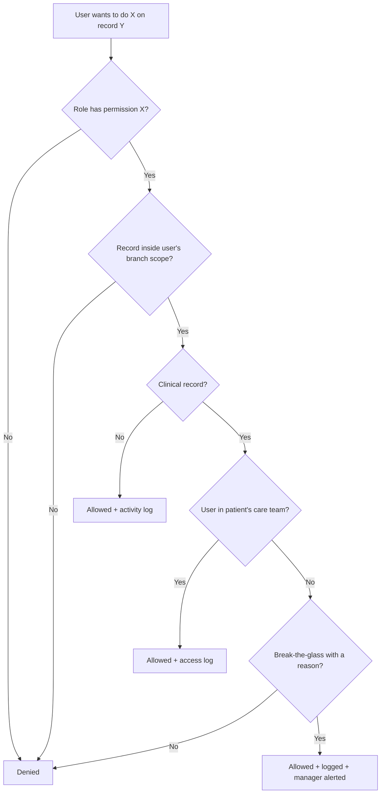

# 06 — User Roles & Permissions + Workflow لكل Role

> بيرد على: **DEL-05 User roles & permissions** + §4 + §18 + §25 + (HP-16/17).
> وكمان **Phase 3 في البريف: Workflow لكل Role** (الجزء 4 تحت).

---

## 1. النموذج: 4 طبقات حماية

1. **Role ← Permissions:** كل دور عبارة عن مجموعة صلاحيات بالشكل ده: `resource.action` (مثلاً `appointments.manage`، `payments.refund`).
2. **Branch scope:** الصلاحية على فرع معيّن أو على كل الفروع.
3. **Care-team scope:** الملف الطبي بيشوفه الفريق المعالج للمريض بس (اللي ليه موعد أو خطة أو برنامج معاه). القاعدة دي قابلة للضبط.
4. **Patient visibility:** المريض بيشوف العناصر اللي متعلّم عليها `patient_visible` بس.

والعمليات الحساسة (Refund، خصم فوق الحد، Export، دمج ملفات، فتح ملف طبي من بره الفريق المعالج) محتاجة صلاحية خاصة وبتتسجل.

> كل ده بيتفحص في الـBackend. إخفاء الزرار من الشاشة "تجميل" بس ومش بيعتبر حماية.

---

## 2. الأدوار (Roles)

| الدور | في البريف؟ | بيعمل إيه | النطاق |
|---|---|---|---|
| **Patient** | §2، §3 | التطبيق والبورتال | بياناته هو بس (وفي P3: أفراد عيلته) |
| **Reception** | ✅ | المواعيد + البيانات الأساسية + المدفوعات | فرعه |
| **Doctor** | ✅ | Dermatology / Internal Medicine / أي تخصص طبي | مرضاه في تخصصه |
| **Nutrition Specialist** | ✅ | Nutrition module | مرضاه |
| **Physiotherapist** | ✅ | Physio module | مرضاه |
| **Assistant** | ✅ | تجهيز المريض: Vitals وقياسات ورفع ملفات | فرعه |
| **Branch Manager** | ✅ | تشغيل الفرع والداشبورد بتاعه | فرعه |
| **Manager (Operations)** | ✅ "Managers" | زي مدير الفرع لكن على أكتر من فرع | الفروع المتعيّنة له |
| **CEO / Management** | ✅ | كل حاجة | كل الفروع |
| **Admin** | ✅ | إدارة النظام والإعدادات | النظام (من غير بيانات طبية افتراضيًا) |
| **CRM Agent / Call Center** | مقترح | الـLeads والتواصل والحجز | الـLeads المتعيّنة له |
| **Marketing** | مقترح | الحملات والمحتوى والعروض | أرقام مجمّعة بس |
| **Finance / Accountant** | مقترح | الفواتير والمرتجعات والتقارير المالية | كل الفروع أو المتعيّنة |

- الأدوار دي **Templates**: الـAdmin يقدر يعدّلها أو يعمل أدوار جديدة من غير كود.
- نفس الشخص ممكن يكون له أكتر من دور (مثلاً طبيب وفي نفس الوقت مدير فرع).

---

## 3. مصفوفة الصلاحيات

**الرموز:** ✅ كامل (قراءة + تعديل) · 👁 قراءة بس · ➕ إضافة / رفع بس · ⚠️ بشروط (شوف الملاحظات) · — مفيش
**النطاق:** (B) فرعه · (C) مرضاه / الفريق المعالج · (A) المتعيّن له · (*) كل الفروع · (own) بتاعه هو

| الصلاحية | REC | DOC | NUT | PHY | AST | CRM | MKT | FIN | BM | OPS | CEO | ADM | PAT |
|---|---|---|---|---|---|---|---|---|---|---|---|---|---|
| بيانات المريض الأساسية | ✅ B | 👁 C | 👁 C | 👁 C | 👁 B | 👁 A | — | 👁 * | 👁 B | 👁 | 👁 * | ⚠️ ¹ | ✅ own |
| التاريخ المرضي والحساسية والأدوية | — | ✅ C | 👁 C | 👁 C | 👁 C | — | — | — | — | — | ⚠️ ² | — | 👁 own |
| Nutrition module | — | 👁 C | ✅ C | — | ➕ | — | — | — | — | — | ⚠️ ² | — | 👁 ³ |
| Physio module | — | 👁 C | — | ✅ C | ➕ | — | — | — | — | — | ⚠️ ² | — | 👁 ³ |
| Dermatology / Internal Medicine | — | ✅ C | ⚠️ ⁴ | ⚠️ ⁴ | ➕ | — | — | — | — | — | ⚠️ ² | — | 👁 ³ |
| القياسات والـVitals | — | ✅ C | ✅ C | ✅ C | ✅ B | — | — | — | — | — | 👁 * | — | 👁 ➕ ⁵ |
| التحاليل والأشعة والتقارير | ➕ B | ✅ C | 👁 C | 👁 C | ➕ B | — | — | — | — | — | ⚠️ ² | — | 👁 ➕ |
| صور Before/After | — | ✅ C | ⚠️ | ⚠️ | ➕ | — | ⚠️ ⁶ | — | — | — | ⚠️ ² | — | 👁 own |
| المواعيد والكالندر | ✅ B | 👁 own | 👁 own | 👁 own | 👁 B | ✅ | — | — | ✅ B | ✅ | 👁 * | — | ✅ own |
| Check-in | ✅ B | — | — | — | ✅ B | — | — | — | ✅ B | — | — | — | — |
| الفواتير والتحصيل | ✅ B | — | — | — | — | ⚠️ ⁷ | — | ✅ * | 👁 B | 👁 | 👁 * | — | 👁 own |
| المرتجعات (Refunds) | ⚠️ طلب | — | — | — | — | — | — | ✅ موافقة | ⚠️ لحد مبلغ | — | ✅ | — | — |
| خصم يدوي | ⚠️ لحد X% | — | — | — | — | ⚠️ لحد X% | — | ✅ | ⚠️ لحد Y% | ⚠️ | ✅ | — | — |
| الأسعار والـCatalog | 👁 | 👁 | 👁 | 👁 | — | 👁 | 👁 | ✅ | 👁 | 👁 | ✅ | ✅ | — |
| الـLeads (CRM) | ➕ B | — | — | — | — | ✅ A | 👁 مجمّع | — | ✅ B | ✅ | 👁 * | — | — |
| الحملات والمحتوى والعروض | — | — | — | — | — | 👁 | ✅ | — | 👁 | 👁 | 👁 | — | — |
| تسجيل المريض في برنامج / نقل مرحلة | ➕ | ✅ C | ✅ C | ✅ C | — | — | — | — | 👁 B | 👁 | 👁 * | — | 👁 own |
| بناء البرامج والفورمز (Builders) | — | ⚠️ ⁸ | ⚠️ ⁸ | ⚠️ ⁸ | — | — | — | — | — | ✅ | ✅ | ✅ | — |
| داشبورد الفرع والتقارير | — | 👁 own | 👁 own | 👁 own | — | 👁 own | 👁 CRM | 👁 مالي | ✅ B | ✅ | ✅ * | — | — |
| الداشبورد الشامل (كل الفروع) | — | — | — | — | — | — | — | 👁 مالي | — | ⚠️ فروعه | ✅ | — | — |
| الموظفين والأدوار | — | — | — | — | — | — | — | — | ⚠️ ⁹ | ⚠️ | ✅ | ✅ | — |
| إعدادات النظام والـIntegrations | — | — | — | — | — | — | — | — | — | — | 👁 | ✅ | — |
| الـAudit log | — | — | — | — | — | — | — | — | ⚠️ B | — | 👁 | 👁 | — |
| تصدير البيانات (Export) | — | — | — | — | — | — | — | ⚠️ مالي | ⚠️ B | ⚠️ | ✅ | ⚠️ ¹⁰ | ✅ own |
| دمج ملفين مكررين | ⚠️ طلب | — | — | — | — | — | — | — | ✅ B | — | — | ✅ | — |

**الملاحظات:**

1. الـAdmin بيشوف البيانات الأساسية بغرض الدعم الفني بس، وكل فتح بيتسجل.
2. **الـCEO والملف الطبي:** البريف بيقول "CEO → everything". توصيتنا إن الـCEO يشوف كل الأرقام والتقارير والملخصات عادي، لكن فتح ملف طبي بالتفصيل يبقى **Break-the-glass**: بيتسجل ومعاه السبب. ده بيحمي Oxygen قانونيًا ومش بيقلل من صلاحية الـCEO. **القرار لـOxygen.**
3. المريض بيشوف اللي الأخصائي نشره بس (الخطة، الملخص، القياسات)، مش الملاحظات الداخلية.
4. أخصائي التغذية والـPhysio بيشوفوا الجزء المهم ليهم بس (التحاليل، التشخيص، الأدوية) من ملف الطبيب. ده سؤال مفتوح لـOxygen (سؤال 10).
5. في P2 المريض بيسجل قياساته بنفسه (وزن / ضغط / سكر).
6. التسويق يستخدم الصور **بس** لو المريض وقّع موافقة تسويق منفصلة.
7. الـCRM Agent يقدر يبعت لينك دفع بس، ومش بيستلم فلوس.
8. الأخصائيين يقدروا يقترحوا Templates، والنشر بموافقة (Clinical lead / Admin).
9. مدير الفرع يدير موظفين فرعه وجداولهم بس، ومبيغيرش الصلاحيات.
10. الـAdmin يعمل Export كامل بموافقة الإدارة بس.

---

## 4. Workflow لكل Role (يوم في حياة كل دور)

### Reception

1. يفتح **Today Board** للفرع.
2. المريض يوصل → بحث بالموبايل → **Check-in** (لو جديد: تسجيل سريع + الموافقات).
3. لو عليه مبلغ أو هيشتري باقة → فاتورة + تحصيل → الإيصال يوصل على الواتساب.
4. يحجز المتابعة الجاية **قبل ما المريض يمشي**.
5. المكالمات والـWalk-in → Lead أو حجز مباشر.
6. آخر اليوم: **تقفيل الخزنة** (المتوقع مقابل الفعلي).

### Doctor / Nutrition / Physio

1. **My Day:** مواعيد النهارده + تنبيهات (تحاليل جديدة، وفي P2 رسائل وقراءات عدّت الحد).
2. المريض عمل Check-in → يفتح **Patient 360** → يبدأ **Encounter** مربوط بالموعد.
3. يملأ فورم التخصص + القياسات → التشخيص → الخطة.
   - Nutrition: Nutrition plan builder.
   - Physio: Treatment plan + **HEP builder** (تمارين بالفيديو + Sets/Reps).
   - Derm: Treatment plan + صور التقدم.
   - IM: Vitals + تحاليل + أدوية.
4. يحدد اللي يظهر للمريض → ينشر الخطة على التطبيق (إشعار "New plan").
5. يوقّع ويقفل الزيارة → يحدد المتابعة → الجلسة بتتخصم من الباقة لوحدها.
6. ينقل المريض لمرحلة البرنامج اللي بعدها لو مناسب.

### Assistant

1. يجهز المريض: Vitals والقياسات (وزن، طول، ضغط، Body composition).
2. يرفع التحاليل والأشعة اللي المريض جايبها معاه.
3. يصوّر صور التقدم، بعد ما يتأكد إن الموافقة موجودة.

### CRM Agent

1. **My Leads:** الجديدة (بعداد SLA) + المتابعات اللي ميعادها جه.
2. يتصل أو يبعت واتساب → يسجل النتيجة (**Contacted**).
3. يأهّل (**Qualified**) → يحجز من نفس الشاشة (**Booked**) أو يبعت لينك دفع.
4. لو مش مهتم → **Lost** مع السبب.
5. آخر اليوم يشوف أرقامه: نسبة التواصل، ونسبة الحجز.

### Branch Manager

1. الصبح: **Branch Dashboard**: مواعيد النهارده، No-shows امبارح، الإيراد، الـLeads المتأخرة.
2. يراجع جداول الأطباء والغرف والإجازات.
3. الموافقات: مرتجعات وخصومات فوق الحد.
4. يتابع الـSLA بتاع الـCRM وطوابير الـDigital care (P2).
5. تقرير أسبوعي للإدارة.

### CEO

1. **Executive Dashboard:** النهارده + كل الفروع + المقارنة.
2. الـ**Funnel:** فين بنخسر المرضى؟
3. الـ**Digital Business** (P2): MRR، Churn، Renewal.
4. التقارير بالفلاتر + Export.
5. الموافقات الاستثنائية.

### Admin

1. إضافة فروع وغرف وموظفين وأدوار.
2. إدارة الـTemplates (الفورمز والإشعارات) والـIntegrations.
3. مراجعة الـAudit log والصلاحيات كل 3 شهور.

### Patient

1. يشوف إعلان أو يسمع من حد → الويبسايت → يحجز (أو يملأ فورم والـCRM يكلمه).
2. ييجي الزيارة → يستلم الخطة على التطبيق.
3. يتابع: تذكيرات، تمارين، قياسات، وفي P2 رسائل مع الفريق.
4. يجدد الباقة أو الاشتراك من التطبيق.
5. يدعو صحابه بكود (P2).

---

## 5. سياسات أمان مرتبطة بالصلاحيات

- **2FA إجباري** لكل موظف بيشوف بيانات طبية أو مالية.
- الداشبورد بيقفل بعد **30 دقيقة** من غير استخدام (قابل للضبط).
- **مراجعة الصلاحيات كل 3 شهور** (Access review).
- الموظف اللي ساب الشغل: **تعطيل الحساب فورًا** (Offboarding checklist).
- كل Export بيتسجل، والـExport اللي فيه بيانات طبية محتاج صلاحية خاصة.

التفاصيل الكاملة في [10-security.md](10-security.md).
