# 07 — السايكلز والرسومات (Lifecycles & Flows)

> بيرد على: **Phase 2 في البريف: User Journey** + §7 (CRM) + §9 (Programs) + §13 (Subscriptions) + §16 (Patient Journey).
> لو الرسومات مش ظاهرة في VS Code: سطّب Extension **Markdown Preview Mermaid Support**، أو افتح الملف على GitHub.

| # | السايكل | ليه مهم |
|---|---|---|
| 1 | الدورة الكبيرة للمريض | الصورة اللي البيزنس كله ماشي عليها |
| 2 | حدث واحد بيحرّك النظام كله | يوضح ليه النظام "Smart" |
| 3 | الـCRM Pipeline والـMilestones | §7 + §16 |
| 4 | دخول الـLead | منين وإزاي |
| 5 | دورة حياة الموعد | §6 |
| 6 | الزيارة الطبية (Encounter) | §8 |
| 7 | البرنامج (Secret Seven) | §9 |
| 8 | دورة حياة الباقة | §10 |
| 9 | دورة حياة الاشتراك | §13 |
| 10 | Physio Home (HEP) | §8 + §11 |
| 11 | الدفع أونلاين | §12 |
| 12 | الإشعارات | §14 |
| 13 | دورة تطوير المشروع | §29 |

---

## 1. الدورة الكبيرة للمريض (The Oxygen Cycle)

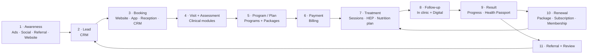

**الدايرة بتقفل مرتين:**
- **Renewal ← Treatment:** المريض بيجدد وبيكمل، ودي الـRecurring revenue.
- **Referral ← Lead:** المريض الراضي بيجيب مريض جديد، وده أرخص Lead ممكن.

كل خطوة في الدايرة دي ليها Module مسؤول عنها وبتسجّل Milestone، فالـCEO يقدر يشوف الدايرة دي كأرقام (الـFunnel).

---

## 2. حدث واحد بيحرّك النظام كله

مثال: مريض اشترى برنامج Secret Seven.

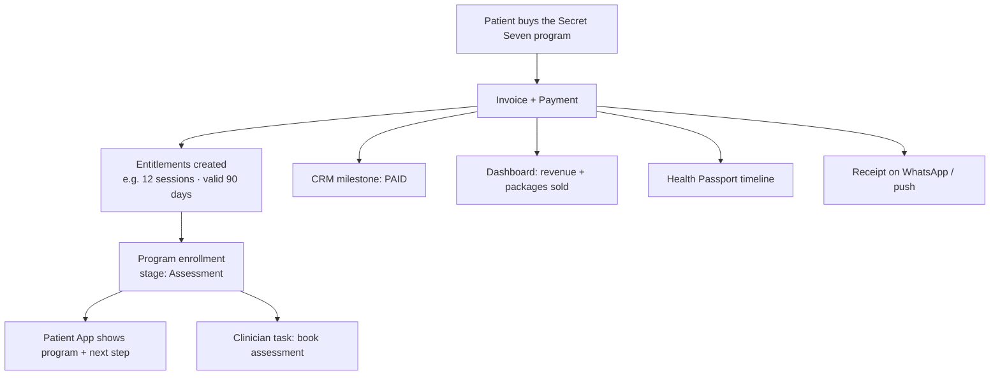

الموظف عمل حاجة واحدة بس (حصّل فلوس)، والنظام عمل 8 حاجات لوحده. ده معنى **Smart Clinic OS**.

---

## 3. الـCRM Pipeline والـMilestones

### المراحل الـ12 اللي في البريف (§7)

🟧 **برتقالي = يدوي** (الـAgent بيسجله) · 🟩 **أخضر = تلقائي** (النظام بيسجله من الأحداث)

```mermaid
flowchart LR
    L["Lead"] -->|agent logs call or WhatsApp| CT["Contacted"]
    CT -->|agent qualifies| Q["Qualified"]
    Q -->|appointment created| BK["Booked"]
    BK -->|check-in| V["Visited"]
    V -->|assessment signed| ASM["Assessment"]
    ASM -->|enrolled in program or plan| PR["Program"]
    PR -->|payment succeeded| PD["Paid"]
    PD -->|first treatment session done| TR["Treatment"]
    TR -->|follow-up done| FU["Follow-up"]
    FU -->|package or subscription renewed| RN["Renewal"]
    RN -->|referred a new lead| RF["Referral"]
    classDef manual fill:#FFF4E5,stroke:#F59E0B,color:#7A4B00
    classDef auto fill:#E6F4F1,stroke:#0E8C7F,color:#0B2E2B
    class L,CT,Q manual
    class BK,V,ASM,PR,PD,TR,FU,RN,RF auto
```

> **أهم نقطة:** 9 مراحل من 12 بتتحدث لوحدها. الـAgent مش هيقعد يسحب الكروت بإيده،
> النظام بيعرف إن المريض حجز وحضر ودفع وجدد من الأحداث نفسها. فالداتا دايمًا صح، ومحدش بيدخلها مرتين.

### توحيد الـCRM (12 مرحلة) مع الـJourney (9 مراحل) — نموذج الـMilestones

البريف فيه قايمتين مختلفتين (§7 و§16). الحل إن كل مرحلة تتسجل كـ**Milestone بتاريخها**، مش مجرد خانة بتتغير:

| Milestone | مرحلة الـCRM (§7) | مرحلة الـJourney (§16) | بيتسجل إزاي |
|---|---|---|---|
| `LEAD_CREATED` | Lead | Lead | تلقائي، من أي مصدر |
| `CONTACTED` | Contacted | — | يدوي: الـAgent يسجل تواصل |
| `QUALIFIED` | Qualified | — | يدوي |
| `BOOKED` | Booked | Booking | تلقائي: أول حجز |
| `VISITED` | Visited | — | تلقائي: أول Check-in |
| `ASSESSED` | Assessment | Assessment | تلقائي: الـAssessment اتقفل |
| `PROGRAM_STARTED` | Program | Program | تلقائي: التسجيل في برنامج أو خطة |
| `PAID` | Paid | — | تلقائي: أول دفعة |
| `TREATMENT_STARTED` | Treatment | Treatment | تلقائي: أول جلسة علاج |
| `FOLLOW_UP` | Follow-up | Follow-up | تلقائي: متابعة اتعملت (في العيادة أو أونلاين) |
| `RESULT_ACHIEVED` | — | Result | يدوي من الأخصائي، أو قاعدة (مثلاً وصل للوزن المستهدف) |
| `RENEWED` | Renewal | Renewal | تلقائي: تجديد باقة أو اشتراك |
| `REFERRED` | Referral | Referral | MVP يدوي، P2 تلقائي (حد جه بكوده) |
| `LOST` | Lost | Drop-off | يدوي، أو تلقائي لو مفيش أي نشاط X يوم |

- **"المريض واقف فين؟"** = آخر Milestone وصلها.
- **"هل حجز؟ هل حضر؟ هل اشترى؟ هل رجع؟ هل جدد؟"** = هل الـMilestone دي موجودة، وإمتى.
- **"دفع كام؟ اشترى إيه؟"** = من الفواتير المربوطة بنفس الشخص.
- **"أين نفقد المرضى؟"** = عدد اللي وصلوا لكل Milestone (Funnel) والنسبة بين كل مرحلتين.

---

## 4. دخول الـLead

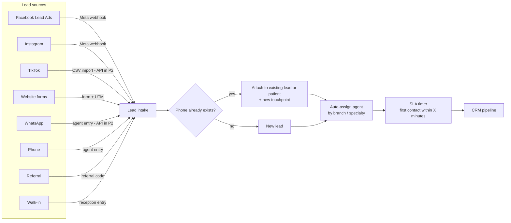

- **Campaign** مش مصدر لوحده، دي صفة بتتسجل مع أي مصدر (UTM أو Campaign ID).
- **منع التكرار برقم الموبايل** (بصيغة موحّدة): لو الشخص موجود، بيتضاف له "Touchpoint" جديد بدل Lead مكرر.
- **الـSLA:** الـLead اللي بيتكلم في أول 5–15 دقيقة نسبة تحويله أعلى بكتير. الداشبورد بيبيّن مين اتأخر.

---

## 5. دورة حياة الموعد

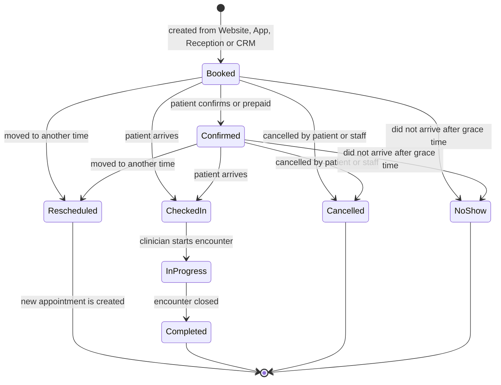

| القاعدة | الاقتراح (محتاج تأكيد Oxygen) |
|---|---|
| التذكيرات | تأكيد فوري + قبلها بـ24 ساعة + قبلها بساعتين |
| No-show | بعد 15 دقيقة من الميعاد من غير Check-in، الريسبشن يأكد |
| الإلغاء المجاني | لحد 24 ساعة قبل الميعاد |
| الجلسة من الباقة | بتتخصم عند **Completed**. وعند No-show حسب السياسة |
| Rescheduled | الموعد القديم بيتقفل كـRescheduled، وبيتعمل موعد جديد مربوط بيه (عشان نعرف كام مرة المريض أجّل) |

---

## 6. الزيارة الطبية (Encounter)

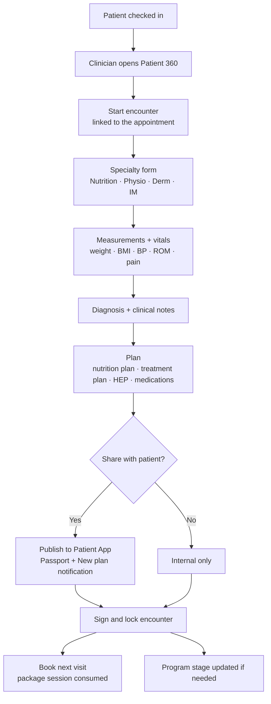

- بعد **التوقيع** الزيارة بتتقفل. أي تعديل بعد كده بيبقى **Amendment** متسجل بتاريخه واسم اللي عدّل (مفيش مسح للتاريخ الطبي).
- الـAssistant يقدر يدخل القياسات قبل ما الأخصائي يبدأ، فيوفّر وقته.

---

## 7. البرنامج: Secret Seven

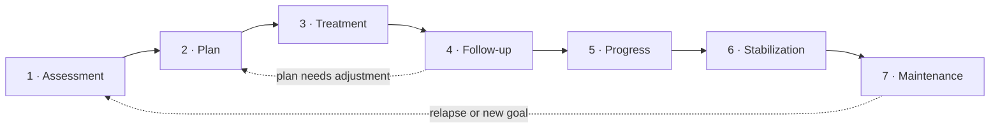

كل مرحلة في الـProgram builder بتتعرّف بالشكل ده (القيم دي **مثال** لحد ما Oxygen تأكد تفاصيل البرنامج):

| المرحلة | الأخصائي بيعمل | المريض بيشوف في التطبيق | النظام بيعمل لوحده | تخلص إمتى |
|---|---|---|---|---|
| 1 · Assessment | تقييم كامل + قياسات البداية (Baseline) | ترحيب + هيحصل إيه + تعليمات التحضير | مهمة حجز التقييم + رسالة ترحيب | الـAssessment اتقفل |
| 2 · Plan | يبني الخطة | الخطة | إشعار "New plan" + محتوى تعليمي | الخطة اتنشرت |
| 3 · Treatment | الجلسات حسب الخطة | الجلسات والمتبقي + التمارين | تذكيرات المواعيد والتمارين | عدد جلسات أو تاريخ |
| 4 · Follow-up | متابعات دورية | الموعد الجاي + تسجيل القياسات (P2) | تذكير "Follow-up due" | المتابعات اتعملت |
| 5 · Progress | إعادة تقييم + مقارنة بالبداية | رسوم التقدم + تقرير | تقرير تقدم PDF | الهدف اتحقق أو المدة خلصت |
| 6 · Stabilization | زيارات أقل | نصايح الثبات | تذكير شهري | ثبات لمدة X أسابيع |
| 7 · Maintenance | خطة الاستمرار | خطة الصيانة | عرض Membership / اشتراك | مستمرة (أو رجوع لـ1) |

> نفس الـBuilder ده بيتعمل بيه أي برنامج جديد بعدين (PRG-04)، من غير كود.

---

## 8. دورة حياة الباقة (Package / Entitlement)

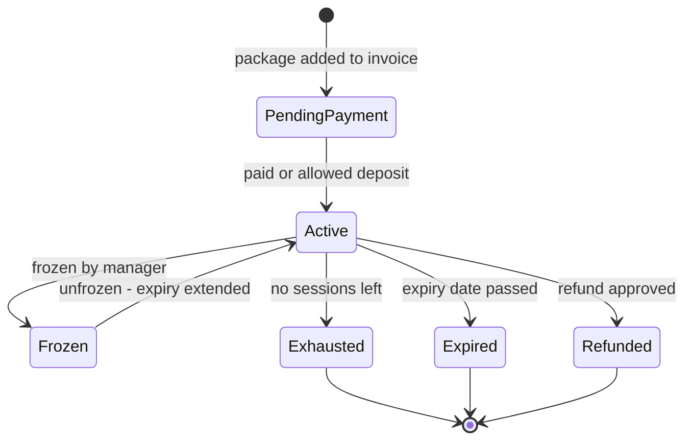

- إشعار **Package ending** لما يفضل جلستين، أو قبل الانتهاء بـ7 أيام.
- **التجديد في الـMVP** = باقة جديدة، وبيتسجل Milestone `RENEWED`.
- **التجميد (Freeze)** مش مذكور في البريف، لكنه شائع في العيادات (سفر / مرض). مقترح، والقرار لـOxygen.

---

## 9. دورة حياة الاشتراك (Subscription Engine — P2)

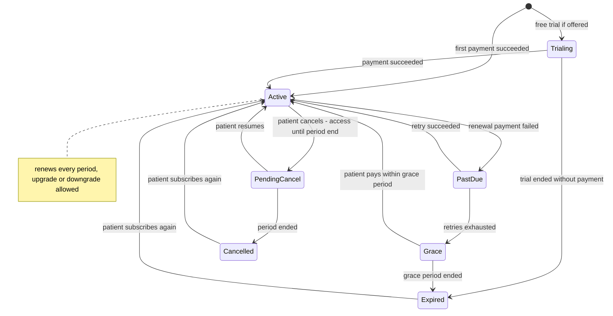

| القاعدة | الاقتراح |
|---|---|
| **Monthly / Quarterly / Annual** | نفس المنتج بـ3 أسعار، والسنوي بخصم |
| **Auto-renewal** | بكارت محفوظ (Token) لو الـGateway بيدعم. لو مش بيدعم: تذكير + لينك دفع |
| **Upgrade** | فوري، ويدفع الفرق بالنسبة للأيام الباقية (Proration) |
| **Downgrade** | بيبدأ مع التجديد الجاي |
| **Cancellation** | الخدمة مستمرة لآخر الفترة المدفوعة |
| **محاولات الدفع** | لو التجديد فشل: إعادة محاولة بعد يوم و3 أيام و5 أيام، وبعدين Grace period |
| **Renewal reminders** | قبل التجديد بـ7 أيام ويوم |

---

## 10. Physio Home: برنامج التمارين في البيت

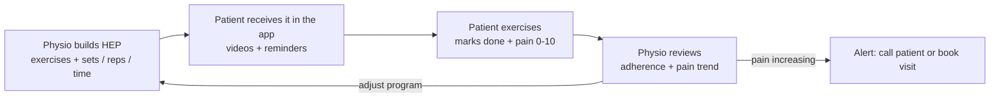

- **MVP:** الخطوتين الأولانيين (البناء والإرسال للتطبيق بالفيديو).
- **P2 (Oxygen Physio Home):** التتبع والألم والمراجعة والتنبيهات، والمنتج ده بيتباع كاشتراك.

---

## 11. الدفع أونلاين

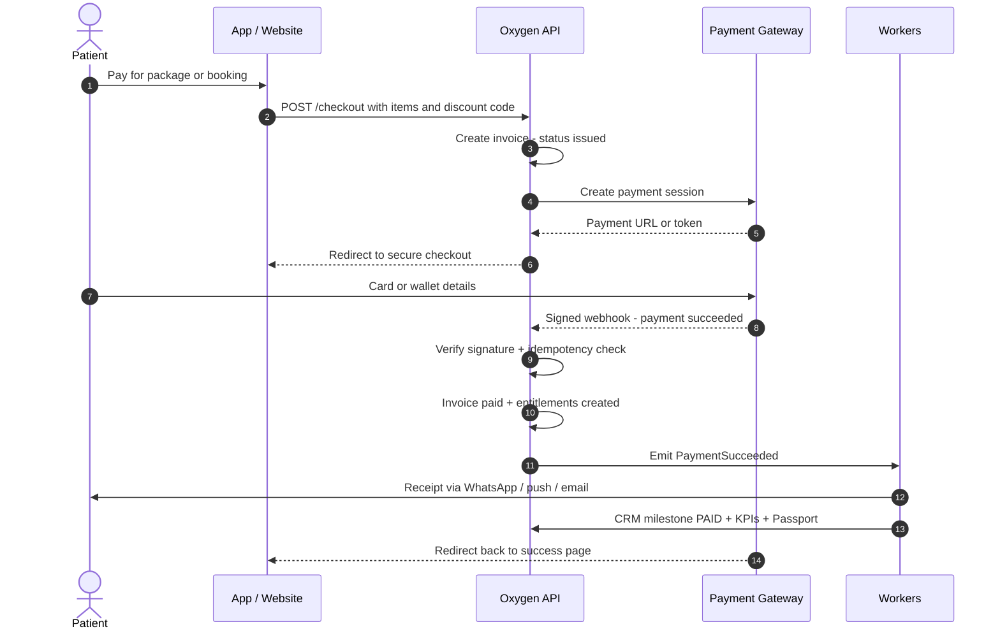

- **بيانات الكارت عمرها ما بتعدي على سيرفراتنا.** المريض بيدفع في صفحة الـGateway نفسها، وده بيقلل مسؤوليتنا الأمنية (PCI) جدًا.
- الاعتماد على الـ**Webhook الموقّع** مش على رجوع المريض للصفحة. لو المريض قفل المتصفح بعد الدفع، الفاتورة برضه هتتقفل صح.

---

## 12. الإشعارات

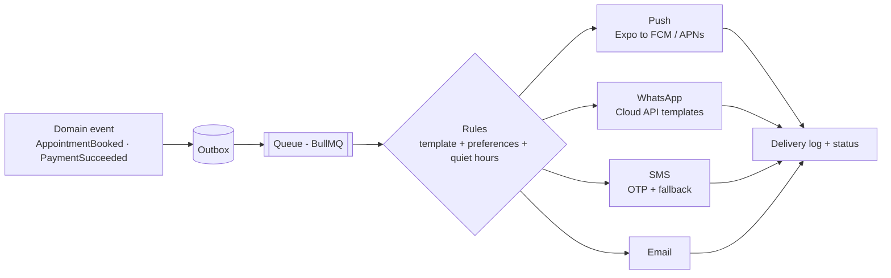

**ترتيب القنوات (عشان التكلفة):** Push الأول (ببلاش) → WhatsApp للمهم (التذكيرات والإيصالات) → SMS للـOTP أو لو الواتساب فشل → Email للفواتير والتقارير.
**أوقات الهدوء:** مفيش رسائل من 10 بالليل لـ9 الصبح، ما عدا الـOTP.

| الإشعار (§14) | إمتى بيتبعت | المرحلة |
|---|---|---|
| Appointment reminder | عند الحجز + قبلها بـ24 ساعة + قبلها بساعتين | MVP |
| Payment reminder | بعد استحقاق الفاتورة بيوم و3 أيام | MVP |
| Follow-up due | قبل ميعاد المتابعة المفروض بـX أيام لو مفيش حجز | MVP |
| Package ending | لما يفضل جلستين، أو قبل الانتهاء بـ7 أيام | MVP |
| New plan | فورًا لما الأخصائي ينشر الخطة | MVP |
| Important clinic notification | رسالة عامة من الإدارة (إجازة، فرع جديد…) | MVP |
| Subscription ending | قبل التجديد بـ7 أيام ويوم | P2 |
| Exercise reminder | يوميًا في الميعاد اللي المريض يختاره | P2 |
| Nutrition reminder | تذكير تسجيل الوجبات | P2 |
| Doctor message | فورًا | P2 |

---

## 13. دورة تطوير المشروع

### الـ10 مراحل اللي في البريف (§29)

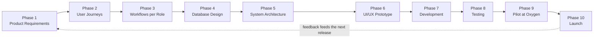

### جوه Phase 7: دورة الـSprint (كل أسبوعين)

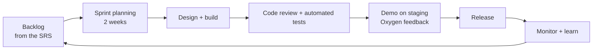

> كل أسبوعين Oxygen بتشوف حاجة شغالة على Staging وتدّي رأيها. كده مفيش مفاجآت في الآخر.
> التواريخ والمدد في [08-roadmap.md](08-roadmap.md).
