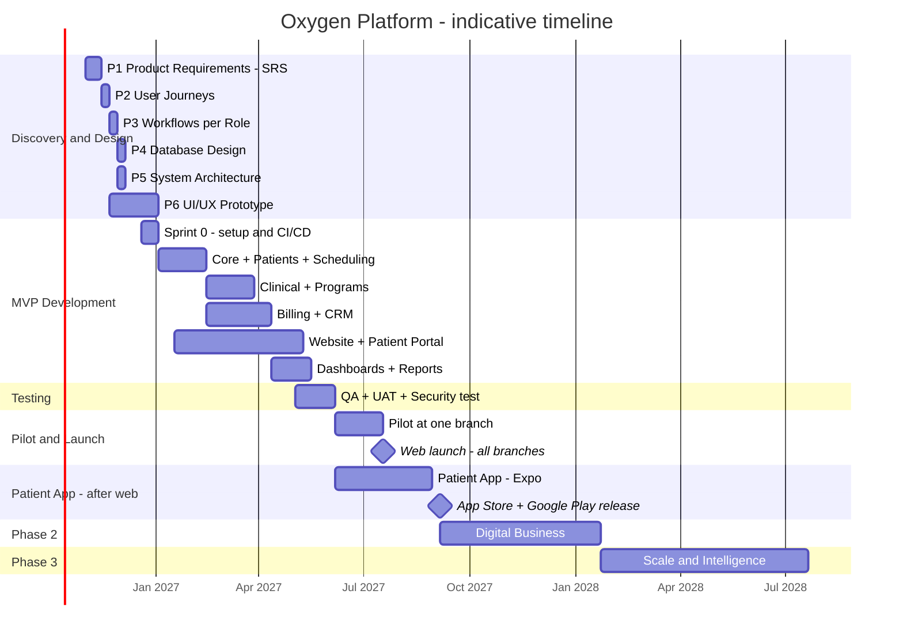

# 08 — Roadmap: MVP / Phase 2 / Phase 3 + Timeline + الخطوات

> بيرد على: **DEL-06 MVP** · **DEL-07 Phase 2** · **DEL-08 Phase 3** · **DEL-09 Development timeline** + §29 (مش هنبدأ بالبرمجة مباشرة).

---

## 1. المشروع في 3 إصدارات

| الإصدار | الاسم | الهدف | مستويات البريف |
|---|---|---|---|
| **MVP (R1) — الويب** | Clinic Core + CRM | العيادة كلها تشتغل على النظام، والـCRM والداشبورد شغالين، والمريض عنده Website + Patient Portal | PATIENT + CLINIC + MANAGEMENT |
| **R1.5** | Patient App | تطبيق الموبايل للمريض على نفس الـAPI، بعد ما الويب يخلص | PATIENT |
| **Phase 2 (R2)** | Digital Business | الاشتراكات والمنتجات الرقمية المدفوعة + التفاعل (Referral، Reviews، Content، Messaging) | DIGITAL BUSINESS |
| **Phase 3 (R3)** | Scale & Intelligence | Family، Corporate، Inventory، Finance كامل، AI، التجهيز للـSaaS | التوسع |

### ليه التقسيم ده؟

1. **المنتجات الرقمية مبنية على حاجات لازم تبقى موجودة الأول:** ملف المريض، الخطط، الدفع، التطبيق. لو بدأنا بالرقمي هنبني على أرض مش ثابتة.
2. **الـPilot (Phase 9) محتاج العيادة نفسها تشتغل على النظام.** ده اللي بيثبّت النظام قدام الموظفين ويطلّع داتا حقيقية.
3. **الـCRM في الـMVP** لأن البريف قال عليه "من أهم أجزاء المشروع"، وبيجيب فلوس من أول يوم.
4. **مفيش إعادة بناء:** الداتابيز والـArchitecture بيتصمموا للـ3 مراحل من أول يوم (جداول الاشتراكات، `organization_id`، فصل الحساب عن المريض).
5. **الويب الأول، والتطبيق في الآخر (قرار):** الـBackend والداشبورد والويبسايت والبورتال الأول. البورتال بيغطي احتياجات المريض في البداية، والتطبيق بيتبني بعدين على نفس الـAPI فمش بياخد وقت كبير. وبييجي **قبل** Phase 2، لأن المنتجات الرقمية محتاجاه (إشعارات يومية، تمارين، Food diary).

---

## 2. الـMVP بالتفصيل

| Module | جوه الـMVP | مش جوه (رايح فين) |
|---|---|---|
| M01 Identity | دخول الموظفين + 2FA، دخول المرضى بـOTP، الأدوار والصلاحيات، Branch scope | SSO للموظفين (P3) |
| M02 Branches | كل الفروع، الغرف، مواعيد العمل | — |
| M03 Patients | الملف، الموافقات، منع التكرار، دمج الملفات | واجهة العيلة (P3) |
| M04 Files | رفع وعرض آمن للملفات | — |
| M05 Notifications | Push + WhatsApp Templates + SMS + Email، والتذكيرات | واتساب في الاتجاهين (P2) |
| M06 Audit | Audit log + Access log + Export + سياسات الحفظ | — |
| M07 Integrations | Payment gateway، Meta Lead Ads، WhatsApp، SMS، Email | TikTok API (P2)، Video (P2) |
| M09 Website | كل الصفحات + الحجز + الدفع + العروض + الفورمز + المقالات | بيع البرامج الرقمية والاشتراكات والعضويات (P2) |
| M10 Portal | **واجهة المريض في الـMVP:** Login، البروفايل، المواعيد (حجز / تأجيل / إلغاء)، المدفوعات والفواتير، الباقات والمتبقي، الملفات، الخطط، القياسات والتقدم، الـPassport، عرض برنامج التمارين | الاشتراكات، الصور، المحادثة (P2) |
| M11 Patient App | — | **R1.5 بعد الويب** (الجزء 2.5 تحت) |
| M12 Passport | Timeline كامل | الاشتراكات (P2) |
| M13 Scheduling | كل حاجة | Waiting list (P2)، الحجز من الواتساب (P3) |
| M14 Front Desk | كل حاجة | — |
| M15 Clinical Core | كل حاجة | — |
| M16 Nutrition | Assessment → Plan → Follow-up + الرسوم + الأهداف + التقارير | Food diary، Macros، Adherence (P2) |
| M17 Physio | Assessment → Plan → Sessions → HEP (إرسال + فيديو) → Discharge | تتبع التنفيذ والألم (P2) |
| M18 Dermatology | Consultation → Plan → صور العيادة → Follow-up | Online follow-up وصور المريض (P2) |
| M19 Internal Medicine | History، Vitals، Labs، Meds، Diagnoses، Follow-up | المتابعة المزمنة والتنبيهات (P2) |
| M20 Programs | Builder v1 + تسجيل المريض + المراحل (Secret Seven) | Automations (P2) |
| M21 Staff | كل حاجة | العمولات (P3) |
| M23 CRM | كل المصادر (TikTok والواتساب يدوي)، Pipeline، Milestones، SLA، Campaigns | WhatsApp / TikTok API (P2) |
| M24 Catalog | جلسة / باقة / برنامج، أسعار لكل فرع، Entitlements | اشتراك / عضوية (P2) |
| M25 Billing | فواتير، تحصيل، دفع أونلاين، مرتجعات، أكواد خصم، تقفيل الخزنة | الكروت المحفوظة والتجديد التلقائي (P2) |
| M26 Finance | تقارير الإيراد (فرع / خدمة)، الخصومات، المرتجعات | المصروفات (P2) · العمولات والتصدير للمحاسبة (P3) |
| M27 Analytics | داشبورد الـCEO والفرع والـCRM، الـJourney Funnel، التقارير + Export | Digital Business Dashboard (P2) |
| M32 Content | مقالات الويبسايت + مكتبة التمارين | محتوى جوه التطبيق مربوط بالبرامج (P2) |
| M33 Telehealth | Online consultation (حجز + دفع + لينك فيديو) | فيديو جوه المنصة + المحادثة (P2) |

### معايير نجاح الـPilot (لازم نتفق عليها مع Oxygen)

- 100% من مواعيد الفرع التجريبي على النظام.
- الريسبشن بيحجز أو بيعمل Check-in في أقل من دقيقة.
- كل Lead جديد بيتسجل ويتوزع، و80% منهم بيتكلموا في وقت الـSLA.
- الـCEO بيشوف أرقام اليوم من غير ما يسأل حد.
- مفيش مشاكل أمنية حرجة في اختبار الاختراق.
- رضا الموظفين 4 من 5 أو أكتر بعد شهر.

---

## 2.5 R1.5 — Patient App (بعد الويب)

- نفس اللي المريض بيعمله في البورتال: Login بـOTP، المواعيد، الملفات، الخطط، القياسات، الـPassport، الباقات، الفواتير، الدفع.
- زيادة على البورتال: **Push notifications**، الدخول بالبصمة أو الوش، مشغّل التمارين بالفيديو، والخطط بتتشاف من غير نت.
- النشر على App Store و Google Play بحسابات Oxygen.
- المدة: **~12 أسبوع**، لأن الـAPI والتصميم بيبقوا جاهزين.
- لازم يخلص **قبل Phase 2**، لأن المنتجات الرقمية معتمدة عليه.

---

## 3. Phase 2 — Digital Business

| المحور | المحتوى | Modules |
|---|---|---|
| **Subscription Engine** | شهري / ربع سنوي / سنوي، تجديد تلقائي، Grace، Upgrade / Downgrade، إلغاء، تذكيرات، إعادة محاولة الدفع | M30 |
| **Memberships** | عضويات بمزايا رقمية ومزايا في العيادة | M30، M24 |
| **المنتجات الرقمية** | Oxygen Online Nutrition · Physio Home · Derm Follow-up · Chronic Care + طوابير شغل للفريق بـSLA | M31 + M16–M19 |
| **التفاعل** | المحادثة الآمنة، الفيديو جوه المنصة، المحتوى التعليمي في التطبيق، صور التقدم من المريض | M33، M32، M18 |
| **النمو** | Referral Engine، Reviews و NPS، Waiting list | M29، M28، M13 |
| **الـCRM** | واتساب في الاتجاهين (أي رسالة = Lead)، TikTok API، Automations للبرامج | M23، M20 |
| **الإدارة** | Digital Business Dashboard (MRR / ARR / Churn)، تحليل أسباب الـDrop-off، المصروفات البسيطة | M27، M26 |
| **المتاجر** | Apple / Google In-App Purchase **لو** اتضح إن المنتجات الرقمية محتاجاه | M30 |

## 4. Phase 3 — Scale & Intelligence

| المحور | المحتوى |
|---|---|
| **Family Accounts** | الأم / الأب يدير ملفات العيلة من حساب واحد |
| **Corporate Wellness** | حسابات الشركات وموظفيها، العقود، فوترة الشركات |
| **Inventory** | المخزون لكل فرع، المشتريات، الاستهلاك لكل خدمة، تنبيهات النقص |
| **Finance كامل** | المصروفات بالكامل، العمولات، التصدير لبرنامج محاسبة، والفاتورة الإلكترونية لو مطلوبة |
| **AI** | تسجيل الأكل بالصورة، مساعد تثقيفي، تلخيص الزيارات، مساعد إداري، تذكيرات ذكية، تحليلات — بحدود واضحة ومن غير ما يحل محل الطبيب |
| **WhatsApp Booking** | الحجز الكامل من الواتساب (Bot) |
| **الربط بالأجهزة** | InBody، Apple Health / Google Health Connect، أجهزة الضغط والسكر |
| **الربط بالمعامل** | استقبال نتائج التحاليل أوتوماتيك |
| **التحليلات المتقدمة** | Data warehouse، Cohorts، Predictive churn |
| **SaaS readiness** | تجهيز النظام لمراكز تانية (Onboarding، عزل البيانات، فوترة المراكز) |

---

## 5. الـTimeline (تقديري)

**الافتراضات:**
- فريق: 1 Tech Lead / Backend · 1 Backend / Full-stack · 1 Frontend (Website + Dashboard) · 1 Mobile (Expo) بعد الويب · 1 UI/UX Designer (متفرغ في الـDiscovery وبعدها Part-time) · 1 QA (من الشهر التالت) · Product Owner من Oxygen (كام ساعة في الأسبوع).
- البداية الافتراضية: **1 نوفمبر 2026**.
- الأرقام دي تقديرية لحد ما الـSRS يخلص. بعده نعمل تقدير دقيق بالـUser stories.



| المرحلة | المدة | الفترة (افتراضي) |
|---|---|---|
| Discovery & Design (Phases 1–6) | ~8 أسابيع | نوفمبر 2026 → أول يناير 2027 |
| تطوير الـMVP — الويب (Phase 7) | ~22 أسبوع | آخر ديسمبر 2026 → منتصف مايو 2027 |
| Testing + UAT + Security (Phase 8) | ~5 أسابيع (متداخلة مع آخر التطوير) | مايو → أول يونيو 2027 |
| Pilot (Phase 9) | ~6 أسابيع | يونيو → منتصف يوليو 2027 |
| **Launch الويب (Phase 10)** | — | **منتصف يوليو 2027** |
| **تطبيق المريض (R1.5)** | ~12 أسبوع | يونيو → أغسطس 2027، والنشر على المتاجر أول سبتمبر |
| Phase 2 | ~5 شهور | سبتمبر 2027 → يناير 2028 |
| Phase 3 | 6 شهور أو أكتر | من يناير 2028 |

> **لو الفريق أصغر** (مثلاً Frontend واحد + Backend واحد): المدة تقريبًا × 1.5 لـ× 2، أو نصغّر الـMVP. ترتيب شغل الفرونت في الجزء 10 تحت.

---

## 6. الفريق المطلوب

| الدور | العدد | الفترة |
|---|---|---|
| Tech Lead / Backend (NestJS) | 1 | طول المشروع |
| Backend / Full-stack | 1 | من Sprint 0 |
| Frontend (Next.js + React) | 1 | من Sprint 0 |
| Mobile (Expo) | 1 | بعد الويب (من يونيو 2027) |
| UI/UX Designer | 1 | متفرغ في الـDiscovery، وبعدها Part-time |
| QA | 1 | من الشهر التالت |
| Product Owner (من Oxygen) | 1 | ساعات أسبوعية + حضور الـDemos |
| بعد الإطلاق (صيانة + تطوير) | 1–2 | مستمر — [09-infrastructure-costs.md](09-infrastructure-costs.md) |

---

## 7. الخطوات: هنمشي إزاي من النهارده

### الأسبوع ده (قبل أي كود)

1. **تراجع الملفات دي** وتأكد الـStack ([01-tech-stack.md](01-tech-stack.md)).
2. **تبعت لـOxygen:** الأسئلة المفتوحة ([00](00-requirements-catalog.md#open-questions)) + الملف ده.
3. **Oxygen تفتح الحسابات باسمها** ([13-ownership-handover.md](13-ownership-handover.md)). ابدأوا بحساب Apple و Google بدري، لأنهم محتاجين **D-U-N-S Number** للشركة، وده ممكن ياخد أيام لأسابيع.
4. **تطلّع صور التصميم** بالبرومبتات ([14-design-prompts.md](14-design-prompts.md)) وتختار الاتجاه اللي هتمشي عليه.

### Discovery & Design (أسابيع 1–8)

| الأسبوع | الشغل | المخرج |
|---|---|---|
| 1–2 | Workshops مع: صاحب البيزنس، الريسبشن، طبيب من كل تخصص، فريق الـCRM، الحسابات | **SRS** (كل Screen + Workflow + Feature) بالقالب اللي في الجزء 9 |
| 3 | مراجعة الـUser Journeys ([07](07-lifecycles.md)) مع Oxygen | Journeys معتمدة |
| 4 | مراجعة الـWorkflows والصلاحيات ([06](06-roles-permissions.md)) | مصفوفة صلاحيات معتمدة |
| 5 | الداتابيز النهائية (Prisma schema draft) + ADRs | Schema + ADRs |
| 3–8 | التصميم: Design system → Wireframes → Figma prototype، ونجربه مع 2–3 موظفين و3–5 مرضى | Prototype معتمد |
| 8 | **Sign-off:** الـSRS + الـPrototype + الـBacklog + التقدير النهائي | خطة التطوير |

### Development (Phase 7): خطة الـSprints

| Sprint | المحتوى |
|---|---|
| S0 | Monorepo، CI/CD، البيئات (Dev / Staging)، Docker compose، هيكل الـAuth، الـDesign system في الكود |
| S1 | الدخول والصلاحيات + الفروع + الموظفين + الـAudit |
| S2 | المرضى + الملفات + الموافقات + البحث |
| S3 | الخدمات + جداول الأطباء + الغرف + Availability engine |
| S4 | الكالندر + الحجز (ريسبشن / CRM) + الحالات + Real-time + التذكيرات |
| S5 | Clinical core: الزيارات + Form engine + القياسات |
| S6 | Templates الـ4 تخصصات + الخطط + الـHEP + Programs v1 |
| S7 | Catalog + Entitlements + الفواتير + الـPOS + تقفيل الخزنة |
| S8 | الدفع الأونلاين + المرتجعات + أكواد الخصم |
| S9 | CRM: Leads، Pipeline، Milestones، Meta webhook، SLA |
| S10 | الداشبوردات + التقارير + Export + حساب الـKPIs |
| S11 | Hardening: الأداء وإصلاحات الأمان |
| **بالتوازي** | الويبسايت + بوابة المريض (S2 → S10) |

### بعد الويب: Sprints تطبيق المريض (R1.5)

| Sprint | المحتوى |
|---|---|
| A1 | Expo + Design system الموبايل + الدخول بـOTP |
| A2 | Home + المواعيد + الحجز |
| A3 | الـPassport + الملفات + الخطط + القياسات |
| A4 | مشغّل التمارين + الباقات + المدفوعات والفواتير |
| A5 | Push notifications + Deep links + البصمة + Cache من غير نت |
| A6 | صور المتاجر والبيانات المطلوبة + المراجعة + النشر |

### Testing (Phase 8)

- Tests أوتوماتيك في كل Sprint (Unit + Integration + E2E للمسارات المهمة).
- **UAT** مع موظفين Oxygen بسيناريوهات مكتوبة لكل Role.
- **Penetration test** من جهة خارجية قبل الإطلاق.
- **Load test** (مثلاً بـk6) على الحجز والداشبورد.
- **Migration dry-run** لو فيه داتا قديمة.

### Pilot (Phase 9)

- فرع واحد لمدة 4–6 أسابيع.
- تدريب لكل Role (جلسات + فيديوهات قصيرة).
- نقل داتا الفرع لو فيه.
- قناة Feedback يومية، وأي Bug بيتراجع خلال 24 ساعة.
- قرار **Go / No-go** حسب معايير النجاح اللي فوق.

### Launch (Phase 10)

- إضافة الفروع واحد ورا التاني (فرع أو اتنين في الأسبوع).
- **Hypercare:** 4 أسابيع دعم مكثف بعد الإطلاق.
- التطبيق بينزل بعدها على App Store و Google Play (R1.5).

---

## 8. Definition of Done (أي Feature تعتبر خلصت إمتى)

- [ ] الكود اتراجع (PR review) ومعاه Tests.
- [ ] الصلاحيات متطبقة في الـBackend.
- [ ] عربي + إنجليزي + RTL.
- [ ] العمليات الحساسة بتتسجل في الـAudit log.
- [ ] اتجربت على Staging واتعمل لها Demo لـOxygen.
- [ ] التوثيق اتحدث (API + docs).

---

## 9. قالب الـSRS لكل شاشة (الخطوة الجاية بعد الملفات دي)

البريف بيقول: *"عايز نقعد نحوله إلى Detailed Software Requirements Document ونحدد كل Screen وكل Workflow وكل Feature"*.
ده القالب اللي هنستخدمه لكل شاشة في [05-apps-structure.md](05-apps-structure.md):

```text
### [D-09] Patient 360
- الهدف:
- مين بيستخدمها (Roles):
- البيانات المعروضة:
- الأفعال (Actions):
- القواعد والتحقق (Business rules / Validation):
- الحالات: Empty / Loading / Error / No permission
- الصلاحيات:
- الأحداث والإشعارات اللي بتطلع منها:
- Analytics events:
- معايير القبول (Given / When / Then):
- مرتبطة بالمتطلبات: HP-01، HP-16 …
```

---

## 10. ترتيب شغل الـFrontend (والباك شغال بالتوازي)

الفرونت **مش بيستنى الباك**: بتتفقوا على الـAPI بتاع كل Feature الأول، وإنت بتشتغل على Mocks لحد ما الـEndpoint الحقيقي يجهز — [15-frontend-backend-contract.md](15-frontend-backend-contract.md).

النظام **Separate**: الموقع (`apps/web`) والداشبورد (`apps/dashboard`) في نفس الـRepo، كل واحد أبلكيشن لوحده.

1. **الأساس للاتنين:** الـWorkspace + Design tokens المشتركة + تسطيب الموقع والداشبورد.
2. **الموقع التعريفي** (`apps/web`): كل الصفحات. مش محتاج الباك، والتفاصيل خطوة بخطوة في [16](16-website-plan.md).
3. **الحجز والدفع والدخول وبوابة المريض كشكل** بداتا وهمية (في نفس الخطة).
4. **الداشبورد** (`apps/dashboard`) بالترتيب ده:
   1. الـLayout + الدخول
   2. الإعدادات (الفروع، الغرف، الخدمات، الموظفين وجداولهم)
   3. الريسبشن (الكالندر، Today Board، تسجيل مريض، Check-in). هنا العيادة تقدر تبدأ تجرب
   4. البحث + Patient 360
   5. الفواتير والتحصيل والباقات
   6. الشاشات الطبية (الزيارة، الخطط، الـHEP، البرامج)
   7. الـCRM
   8. داشبورد الـCEO والتقارير
5. **الربط بالـAPI:** كل شاشة بتتربط أول ما الـEndpoint بتاعها ينزل على Staging.
6. **تطبيق المريض** — في الآخر.
