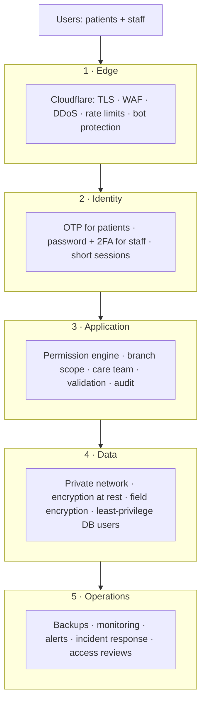

# 10 — Security Architecture & Privacy

> بيرد على: **DEL-13 Security architecture** + §25 (SEC-01 → SEC-11) + AI-08.
> البريف قال: *"ده جزء أساسي جدًا … وخصوصًا إننا بنتعامل مع بيانات طبية."*

---

## 1. الحماية على طبقات (Defense in Depth)

لو طبقة اتكسرت، اللي بعدها بتحمي. مفيش طبقة واحدة بنعتمد عليها لوحدها.

---

## 2. الهوية وتسجيل الدخول (SEC-05 · SEC-06 · SEC-07)

| | المرضى | الموظفين |
|---|---|---|
| **الدخول** | موبايل + OTP (SMS / WhatsApp) | Email + Password + **2FA إجباري** (Authenticator app) |
| **سياسة الباسورد** | مفيش باسورد (OTP) | 12 حرف على الأقل، ومنع الباسوردات اللي اتسربت قبل كده، ومن غير إجبار على التغيير الدوري إلا لو فيه اشتباه (حسب إرشادات NIST الحديثة) |
| **ضد التخمين** | حد أقصى لمحاولات الـOTP وبعدها إيقاف مؤقت | قفل مؤقت بعد محاولات فاشلة + تنبيه |
| **الجلسة** | Access token 15 دقيقة + Refresh بيتغير مع كل استخدام (30 يوم) + فتح بالبصمة | تقفل بعد 30 دقيقة من غير استخدام، وأقصى مدة 12 ساعة، وقايمة بالأجهزة مع تسجيل خروج عن بعد |
| **حفظ التوكن** | SecureStore (Keychain / Keystore) | httpOnly + Secure + SameSite Cookies |
| **استرجاع الحساب** | OTP | الـAdmin يعمل Reset + تفعيل 2FA من جديد |

---

## 3. الصلاحيات (SEC-01)

التفاصيل الكاملة في [06-roles-permissions.md](06-roles-permissions.md). أهم القواعد:

- **Deny by default:** أي حاجة مش مسموحة صراحةً ممنوعة.
- الفحص في الـBackend على كل Request.
- **Branch scope** + **Care team** + **`patient_visible`**.
- **Break-the-glass** للطوارئ: بيتسجل بسبب، والمدير بيوصله تنبيه.
- العمليات الحساسة (Refund، خصم فوق الحد، Export، دمج ملفات) محتاجة صلاحية خاصة أو موافقة.

---

## 4. حماية البيانات (SEC-04)

| الطبقة | الإجراء |
|---|---|
| **أثناء النقل** | TLS 1.2+ في كل حتة + HSTS |
| **على الديسك** | تشفير الداتابيز والـStorage والـBackups (Managed) |
| **تشفير حقول معيّنة** | الرقم القومي، توكنز الدفع، وأي حقل حساس جدًا: تشفير من التطبيق نفسه بمفتاح في KMS |
| **الملفات الطبية** | Bucket خاص (Private)، والعرض بلينكات مؤقتة (دقايق)، ومفيش لينكات عامة |
| **صور المرضى** | بنشيل بيانات الـEXIF، ومنها **مكان التصوير (GPS)**، قبل الحفظ |
| **الكروت** | **مش بنخزن بيانات كروت خالص**: الـGateway هو اللي بيخزن، وإحنا بنحتفظ بـToken بس |
| **الـSecrets** | في Secrets manager، وفيه فحص أوتوماتيك يمنع أي Secret يدخل Git |
| **الـLogs** | **مفيش بيانات طبية في الـLogs** (الموبايل متغطي جزئيًا، ومفيش ملاحظات طبية) |
| **الإعلانات والتحليلات** | مفيش أي بيانات صحية بتروح لـMeta / TikTok / Google، ولا في الـURLs |
| **الإشعارات** | محتوى عام: *"عندك موعد بكرة الساعة 5"* وليس *"موعد متابعة السكر"*. الشاشة المقفولة ممكن حد تاني يشوفها |
| **Data minimization** | بنجمع اللي محتاجينه بس |

---

## 5. Audit & Activity Logs (SEC-02 · SEC-09)

**الـAudit log بيسجل:**
- مين، عمل إيه، إمتى، ومنين (IP / الجهاز).
- القيمة قبل وبعد لأي تعديل على البيانات الحساسة.
- **مين فتح ملف المريض** (حتى من غير تعديل).
- أي Export، وأي تسجيل دخول، وأي تغيير صلاحيات، وأي Refund أو خصم.

**حمايته:**
- Append-only (مفيش صلاحية تعديل أو مسح حتى للـAdmin).
- متقسم شهريًا، وبيتنسخ يوميًا لمكان منفصل.
- في Patient 360 فيه تاب **Access log**: مين فتح الملف ده وإمتى.

**الـActivity log:** للتشغيل والتحليل وحل المشاكل (مين عمل إيه في النظام).

---

## 6. أمان التطبيق (OWASP)

| الموضوع | الإجراء |
|---|---|
| المعيار | OWASP ASVS Level 2 |
| المدخلات | Validation بـZod على كل Endpoint |
| الويب | CSP headers، حماية CSRF مع الـCookies، CORS بقايمة محددة |
| الـAbuse | Rate limiting لكل IP ومستخدم، و Cloudflare Turnstile على الفورمز العامة |
| رفع الملفات | فحص النوع الحقيقي للملف، حد أقصى للحجم، وفحص فيروسات (ClamAV) |
| المكتبات | Renovate + Dependabot alerts + `npm audit` |
| الكود | SAST (CodeQL) + Secret scanning + فحص الـDocker images (Trivy) |
| الـWebhooks | التحقق من التوقيع + منع إعادة الإرسال (Replay) + Idempotency |
| الدفع والحجز | Idempotency keys |
| الداشبورد | Subdomain منفصل، واختياري: تقييد بالـIP أو Cloudflare Access |
| الاختبار | **Penetration test** قبل الإطلاق وكل سنة، ومفيش إطلاق قبل إصلاح الـCritical والـHigh |

---

## 7. الخصوصية والقانون (SEC-10 · SEC-11)

### الموافقات (Consent management)

| الموافقة | إجبارية؟ |
|---|---|
| معالجة البيانات الصحية لتقديم الخدمة | ✅ |
| الاستشارة الأونلاين (Telemedicine) | لما يستخدمها |
| الصور للاستخدام الطبي | لما الخدمة تحتاج |
| **الصور للتسويق** | منفصلة تمامًا واختيارية |
| الرسائل التسويقية | اختيارية (Opt-in) |
| مشاركة البيانات مع معامل أو شركاء | لما تحصل |

كل موافقة ليها **Version** من النص، وبنسجل مين وافق وإمتى وإزاي، والمريض يقدر يسحبها في أي وقت.

### حقوق المريض

- **تصدير بياناته** (PDF / JSON) من التطبيق أو البورتال.
- **حذف الحساب** (Apple و Google بيطلبوه): بيتقفل الحساب ويتمسح أو يتشال منه الاسم كل اللي مش مطلوب قانونيًا،
  والسجل الطبي بيتحفظ للمدة اللي القانون بيحددها، وبعدها بيتمسح أو بيتعمل Anonymize.

### مدة الحفظ (اقتراح — محتاج تأكيد قانوني)

| البيانات | المدة المقترحة |
|---|---|
| السجلات الطبية | حسب القانون (غالبًا سنين طويلة) |
| الفواتير والمدفوعات | حسب قانون الضرائب |
| Leads ما اتحولتش لمرضى | 24 شهر بعد آخر تواصل، وبعدها حذف |
| Audit logs | 5 سنين على الأقل (أو حسب القانون) |
| سجلات الإشعارات | 12 شهر |
| Backups | حسب جدول الـGFS في [09](09-infrastructure-costs.md) |

### القانون

- **لو التشغيل في مصر:** قانون حماية البيانات الشخصية رقم 151 لسنة 2020. البيانات الصحية فيه "بيانات حساسة" ومحتاجة موافقة صريحة والتزامات إضافية (منها تراخيص/تصاريح). وده غير التزامات السرية الطبية.
- **لو في بلد تاني** (مثلاً السعودية): القانون المحلي لحماية البيانات وقواعد البيانات الصحية، وممكن يفرض استضافة البيانات جوه البلد.
- **اتفاقيات معالجة البيانات (DPA)** مع أي مورد بيلمس بيانات المرضى (Cloud، رسائل، دفع).
- ⚠️ **الملف ده مش استشارة قانونية.** لازم محامي متخصص يراجع: الموافقات، سياسة الخصوصية، مكان الاستضافة، ومدد الحفظ قبل الإطلاق.

---

## 8. Incident Response (لو حصلت مشكلة أمنية)

1. **اكتشاف:** تنبيهات المراقبة أو بلاغ.
2. **احتواء:** قفل الحسابات المتأثرة، تغيير الـSecrets، عزل الخدمة.
3. **تقييم:** إيه اللي اتأثر؟ بيانات مين؟
4. **إبلاغ:** الإدارة والمحامي، ثم الجهات المختصة والمرضى المتأثرين في المدة اللي القانون بيحددها.
5. **استرجاع:** من الـBackups لو محتاجين.
6. **Post-mortem:** إيه اللي حصل وإزاي منكررهوش.

وفيه **Runbook** مكتوب + جهات اتصال + تمرين على الورق مرة في السنة.

---

## 9. حدود الـAI (Phase 3 — AI-08)

- **الـAI عمره ما بياخد قرار طبي.** أي مخرج طبي = **مسودة** والأخصائي هو اللي بيعتمدها.
- مفيش بيانات مرضى بتروح لأي مزود AI من غير DPA وموافقة Oxygen، ومع تقليل البيانات أو شيل الهوية لما يكون ممكن.
- الـAI بيلتزم بنفس الصلاحيات: مش هيشوف حاجة المستخدم نفسه مش مسموحله يشوفها.
- مساعد المرضى بيرد من **محتوى Oxygen المعتمد بس**، ومعاه تنبيه واضح وتحويل لإنسان.
- كل مخرجات الـAI بتتسجل وبتتراجع.

---

## 10. Checklist الأمان قبل الإطلاق

- [ ] 2FA مفعّل لكل الموظفين
- [ ] Penetration test + إصلاح كل الـCritical والـHigh
- [ ] الـBackups شغالة + Restore drill ناجح
- [ ] الـAudit log شغال على كل العمليات الحساسة
- [ ] مفيش Secrets في الكود
- [ ] سياسة الخصوصية والشروط والموافقات معتمدة من محامي
- [ ] DPAs موقّعة مع الموردين
- [ ] Incident response plan وجهات الاتصال جاهزة
- [ ] المراقبة والتنبيهات شغالة
- [ ] مراجعة كل الحسابات والصلاحيات قبل الإطلاق
