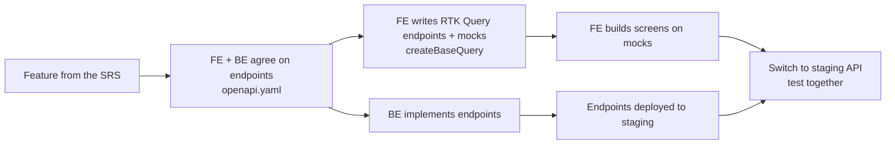

# 15 — الاتفاق بين الـFrontend والـBackend

> الملف ده للـFrontend ومبرمج الباك مع بعض. ابعته له، واتفقوا عليه **قبل أول سطر كود**.
> الهدف: الفرونت ميستناش الباك، والباك ميتفاجئش باحتياجات الفرونت.

---

## 1. الطريقة: Contract-first



1. لكل Feature في الـSRS: الفرونت والباك بيتفقوا على الـEndpoints وشكل الـRequest والـResponse في ملف **OpenAPI** (`openapi.yaml`). الباك في Repo لوحده، والفرونت بياخد نسخة من الملف في Repo بتاعه.
2. الفرونت بيكتب Endpoints الـ**RTK Query** بنفس الـURLs، ومعاها **Mocks** (داتا وهمية عن طريق `createBaseQuery` اللي في `packages/shared` — [DEC-05](19-decisions.md#dec-05)). ولما الملف يكبر، الـEndpoints والـTypes بتتولد منه أوتوماتيك.
3. الفرونت بيبني الشاشات على الـMocks، والباك بينفذ في نفس الوقت.
4. لما الـEndpoint ينزل على Staging، الفرونت بيقفل الـMocks (`API_MOCKING=disabled` في الـenv) ويجرب على الحقيقي.
5. أي تغيير في الـAPI بيبدأ بتعديل ملف الـOpenAPI الأول، ومحدش يغيّر شكل Response من غير ما يبلّغ.

> لو الباك NestJS، ملف الـOpenAPI بيطلع أوتوماتيك من الكود. ولو لغة تانية (Laravel / .NET / …) لازم برضه يطلّع OpenAPI، وكل الـFrameworks المشهورة بتدعمه.

### توليد Endpoints الـRTK Query من الملف (لما الـOpenAPI يجهز)

```ts
// apps/web/openapi-config.ts  (ونفس الفكرة في apps/dashboard)
import type { ConfigFile } from '@rtk-query/codegen-openapi';

const config: ConfigFile = {
  schemaFile: '../../openapi.yaml',
  apiFile: './src/store/base-api.ts', // الـbaseApi اللي فيه الـMocks
  apiImport: 'baseApi',
  outputFile: './src/api/generated.ts',
  exportName: 'oxygenApi',
  hooks: true,                        // useGetDoctorsQuery …
};

export default config;
```

> الـEndpoints المتولدة بتتضاف على نفس الـ`baseApi`، فالـMocks شغالة عليها لحد ما نقفلها من الـenv.

---

## 2. Checklist الاتفاق (يتقفل في أول أسبوع)

| الموضوع | الاتفاق المقترح | ليه مهم للفرونت |
|---|---|---|
| **الدخول على الويب** | httpOnly Secure Cookies + Refresh. والـAPI والفرونت تحت نفس الدومين الرئيسي (`api.<domain>` · `staff.<domain>` · `www.<domain>`) | من غير كده الكوكيز مش هتشتغل بين الدومينات |
| **CORS** | قايمة الدومينات المسموحة + `credentials: true` | عشان الطلبات من المتصفح تعدي |
| **بيانات المستخدم** | `GET /auth/me` بيرجّع: المستخدم، أدواره، **قايمة الـPermissions**، والفروع المسموحة | الفرونت بيظهّر ويخفي الشاشات والزراير منها (والباك برضه بيمنع) |
| **صيغة الأخطاء** | RFC 9457 Problem Details + `code` ثابت لكل خطأ (مثلاً `SLOT_TAKEN`) + أخطاء الحقول في `errors[field]` | الفرونت بيترجم الرسالة عربي / إنجليزي من الـcode، ويحط الخطأ تحت الحقل الصح |
| **الترجمة** | الباك بيرجّع Codes، والنصوص بتتترجم في الفرونت. والداتا اللي ليها لغتين (أسماء الخدمات…) بترجع `name_ar` و`name_en` | الشاشات عربي وإنجليزي |
| **الـPagination** | شكل واحد في كل الـAPI: `{ data, nextCursor, total }` | Component جدول واحد يشتغل في كل حتة (antd Table) |
| **الفلاتر والترتيب** | Query params موحّدة: `?branchId=&from=&to=&sort=-createdAt&q=` | فلاتر الداشبورد والتقارير |
| **التواريخ** | ISO 8601 بالـUTC، والفرونت بيعرض بتوقيت الفرع (`Africa/Cairo`) | الكالندر والتذكيرات |
| **الفلوس** | أرقام صحيحة بأصغر وحدة (قروش) + `currency`، والفرونت هو اللي بيعمل الـFormat | مفيش أخطاء تقريب |
| **الـIDs** | UUID (string) | |
| **الـEnums** | الحالات (Appointment status، Lead stage …) متعرّفة في الـOpenAPI | ألوان الحالات والفلاتر |
| **رفع الملفات** | الفرونت بيطلب Pre-signed URL ← يرفع على الـStorage مباشرة ← يبلّغ الباك | رفع أسرع وأأمن، والملف مش بيعدي على السيرفر |
| **الـRealtime** | Socket.IO: قايمة الـEvents وشكل كل Payload مكتوبين (مثلاً `appointment.created`) | الكالندر بيتحدث لوحده |
| **منع التكرار** | Header `Idempotency-Key` على الدفع والحجز | الضغط مرتين ميعملش حجزين |
| **الدفع** | الباك بيرجّع لينك صفحة الـGateway، والفرونت بيعمل Redirect، والنتيجة النهائية من الباك (Webhook) | الفرونت عمره ما بيلمس بيانات الكارت |
| **Staging** | لينك ثابت + داتا وهمية جاهزة (Seed) + حساب تجربة لكل Role | تجرّب كل الصلاحيات |
| **التوثيق** | Swagger UI على Staging | ترجع له في أي وقت |
| **التغييرات** | أي Breaking change بيتبلّغ قبلها + Changelog | الفرونت ميتكسرش فجأة |

---

## 3. مين مسؤول عن إيه

| الـFrontend | الـBackend |
|---|---|
| Website + Patient Portal (Next.js): SEO، الحجز، الدفع (Redirect)، البورتال | الـAPI + الداتابيز + **الصلاحيات** (الحماية الحقيقية) |
| Staff Dashboard (antd): الشاشات D-01 → D-49 في [05](05-apps-structure.md) | الدفع والـWebhooks |
| Design tokens + RTL + الترجمة | الإشعارات (واتساب / SMS / إيميل / Push) والتذكيرات |
| التحقق على الفورمز (Zod، بنفس قواعد الـOpenAPI) | رفع الملفات (Pre-signed URLs) والـRealtime events |
| إظهار وإخفاء حسب الـPermissions | ملف OpenAPI متحدث دايمًا + Staging شغال + Seed data |
| Analytics events (GA4 / Meta Pixel) من غير بيانات طبية | الـInfrastructure والـBackups والأمان ([09](09-infrastructure-costs.md)، [10](10-security.md)) |
| E2E tests (Playwright) للمسارات المهمة | Tests الـAPI |
| لاحقًا: تطبيق المريض (Expo) | نفس الـAPI بيخدم التطبيق |

---

## 4. طريقة الشغل بينكم

- **أول كل Sprint:** اجتماع نص ساعة: الـEndpoints المطلوبة في الـSprint ده + الاتفاق عليها في الـOpenAPI.
- **كل يوم:** رسالة قصيرة: إيه اللي نزل على Staging، وإيه اللي واقف.
- **آخر كل Sprint:** Demo مشترك لـOxygen.
- **قناة واحدة للأسئلة**، وأي قرار بيتكتب في الـRepo، مش بيفضل في الشات.
